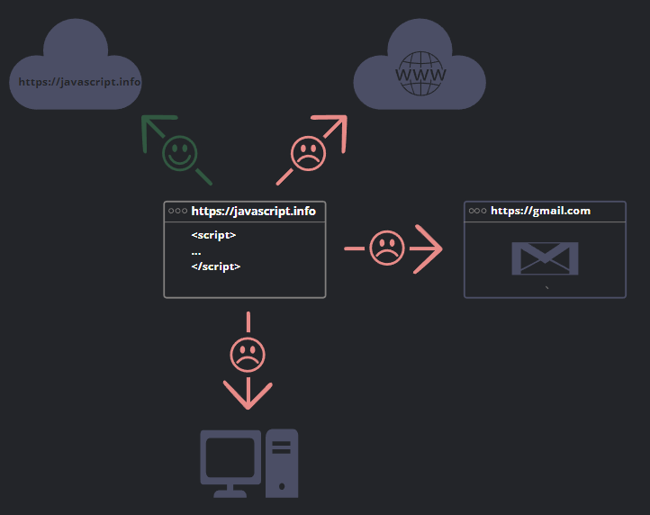
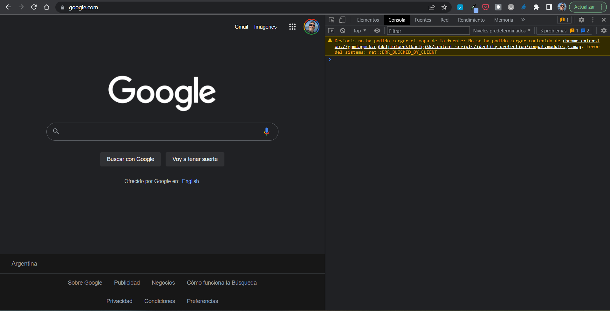
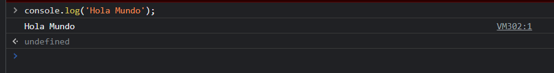
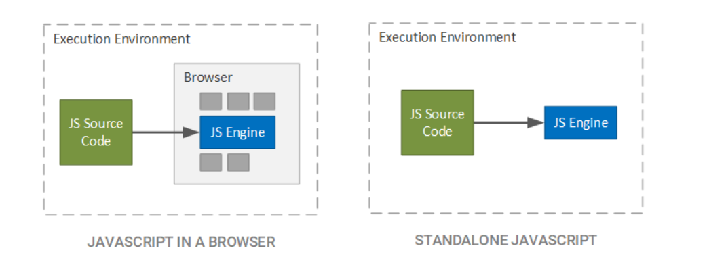
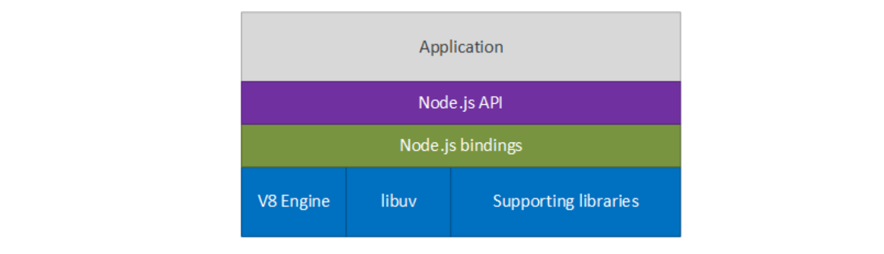

# Apunte 01 - Introducción

En esta semana vamos a introducirnos en el mundo de Desarrollo de Software intentando mostrar una versión más cercana a la realidad que las que se pueden haber percibido en materias anteriores de programación como Algoritmos y Estructuras de Datos o Paradigmas de Programación.

Hoy en día el software que usamos y que mueve al mundo se escribe de muy diversas maneras y sería ilusorio pretender que vamos a ver todas esas alternativas en una asignatura cuatrimestral, sin embargo, hay una de esas maneras, que es la que propone la construcción del software como un conjunto de capas que interactúan entre sí, y donde cada capa conoce a las adyacentes y se comunica con ellas. Este esquema es ampliamente utilizado en la construcción de aplicaciones reales y sin ser el único es un modelo del mundo real y el que vamos a abordar en la asignatura Desarrollo de Software.

Normalmente llamados a estas capas cliente, frontend, backend o database en un modelo simplificado y minimalista.

En general los desarrolladores se especializan en la construcción de cada una de estas capas, así tenemos desarrolladores frontend, desarrolladores backend, dbas o administradores de base de datos, y otros roles. Pero, también hay casos en los que los desarrolladores buscan un conocimiento que abarque las diferentes capas que intervienen en la construcción del software, tal vez no tan especializado sino más amplio y además se involucran en tareas adyacentes al desarrollo como la gestión de configuración, el despliegue de las aplicaciones o la administración de los procesos de prueba. En estos casos hablamos de un Desarrollador o Programador Full Stack y es en grandes rasgos lo que nos proponemos recorrer en esta asignatura.

## ¿Programador Full Stack?

### ¿A qué le llamamos Stack de tecnologías o simplemente stack?

Stack -> Pila:
Pila de capas que se comunican con la anterior y la siguiente

  

La idea es que cada una de las capas está asociada a una tecnología y que en base a esa tecnología es que construimos la aplicación.

Entonces ese stack es la pila de tecnologías con las que se va a construir la aplicación. Existen varias pilas establecidas y muy utilizadas en la industria como LAMP por ejemplo por Linux + Apache + MySql + Php que se utilizó por mucho tiempo para construir aplicaciones web de código abierto, o MERN por Mongo+Express+React+Node que es bastante más actual y se asemeja en algo a lo que vamos a utilizar.

Para cursar la materia, hemos optado entre todas las tecnologías existentes por un conjunto de estas en base a elementos como curva de aprendizaje, facilidad de acceso e integración con los contenidos de la asignatura. Entonces el stack de tecnologías que utilizaremos será más o menos como el siguiente:

    

   >Nota:
   >Es evidente que en el gráfico anterior hay una importante cantidad de logos, cada uno de los cuales representa una tecnología que cumple un papel específico en el Stac.
   > 
   > Hemos incluido aquí los logos de la mayoría de las tecnologías que vamos a utilizar durante el cursado de la asignatura y por lo tanto iremos adquiriendo mayor profundidad sobre cada una de ellas a medida que avancemos en el cuatrimestre.

Donde **Frontend** es la capa donde se programa la interfaz de usuario, **Backend** es la capa donde se programa/orquesta la lógica de negocio, por arriba tenemos a los consumidores de la aplicación, por debajo a la persistencia de los datos, en este caso una base de datos relacional y al costado enumeramos una serie de tecnologías de soporte a la construcción del software pero que no intervienen en el proceso de la ejecución de la aplicación. Describamos brevemente estas capas principales:

**_Cliente_**

El cliente es todo dispositivo que se conecta a nuestro aplicativo, a veces la conexión se produce desde un browser o navegador de internet u otras veces desde aplicativos específicamente desarrollados para proveer la interfaz de usuario, en cualquier caso llamamos cliente al entorno de ejecución de la interfaz de usuario puesto que la capa donde construimos o desarrollamos la interfaz de usuario será la siguiente.

En el caso de nuestra asignatura el cliente será un navegador de internet en cualquier dispositivo para el que exista uno ya que las interfaces que desarrollaremos estarán pensadas para este cliente.

**_Frontend_**

El frontend es la capa en donde desarrollaremos tanto la presentación de la información al usuario, y el estilo visual de dicha presentación como la captura de interacción de este con la aplicación y la lógica asociada a que estos procesos de captura y presentación correspondan con los requerimientos planteados para nuestro aplicativo.

Existen muchas alternativas para construir esta capa pero en nuestro caso de esas alternativas hemos elegido construir el front end en base a elementos utilizados en las aplicaciones reales en la actualidad como React JS, HTML y CSS, como componentes más genéricos entre los que vamos a utilizar.

**_Backend_**

El backend es la capa donde se motorizan las reglas del negocio de la aplicación a desarrollar, es decir, es donde se hacen cumplir las reglas que debemos validar sobre las entidades del sistema, además en esta capa debemos asegurar la aplicación involucrando técnicas de control de acceso y debemos optimizar procesos para lograr dar servicio a la mayor cantidad de usuarios con recursos acotados.

Nuevamente hay un sin número de opciones para programar el backend de una aplicación, quizás en el caso del backend aún más que en forntend porque si bien en frontend el lenguaje de programación javascript es un estándar de facto allí, en el caso del backend aparecen muchas más opciones y muy utilizadas como por ejemplo java, python, go, o el propio javascript que será la opción elegida en la asignatura por una razón evidente, la de utilizar un solo lenguaje de programación a lo largo de todo el stack de la aplicación.

**_Database_**

En realidad la palabra database hace referencia específicamente a la base de datos pero llamamos a esta capa, capa de datos porque tiene que ver con todo lo que la aplicación requiera persistir, base de datos, archivos, o incluso la interconexión con otros sistemas.

En nuestra asignatura utilizaremos Sqlite que es una base de datos relacional embebida en la aplicación para el almacenamiento de los datos.

**_Herramientas_**

Finalmente, en este bloque mencionamos algunas de las herramientas transversales que utilizaremos a lo largo del cuatrimestre para desarrollar nuestra aplicación, como el repositorio de código fuente, herramientas para llevar a cabo pruebas, o el entorno integrado de desarrollo que usaremos para escribir el código y administrar los proyectos.

**_En conclusión_**, hasta aquí hemos revisado algunos conceptos acerca del desarrollo de software en capas y hemos mencionado brevemente las alternativas de especializarnos en una de las capas o aplicarnos a tener un conocimiento sobre todas ellas... en el apartado siguiente intentaremos definir precisamente este último rol.

### Entonces... ¿qué es un Programador Full Stack?

Hacer mención al rol del desarrollador con conocimientos de todas las tecnologías que intervienen en el stack de la aplicación y la capacidad de implementar los requerimientos funcionales programando cada componente necesario en cada una de las capas para que una funcionalidad pueda cumplir con su objetivo.

Hay muchos posts en internet que mencionan que este concepto es un mito o un recurso de empresas para ahorrar dinero con una persona que pueda hacer el trabajo de todo un equipo, sin embargo en realidad en la asignatura lo vemos como una persona que tiene la visión de la aplicación específica de cada uno de los componentes del stack de tecnologías en las solución de la aplicación, no siendo quizás, el mayor experto en ellas o en todas ellas pero, siendo quién puede resolver problemas de integración entre las distintas capas.

Según ChatGPT un programador full stack es _"Un programador Full Stack es un desarrollador de software que tiene conocimientos y experiencia en todas las capas del desarrollo de una aplicación, desde el frontend hasta el backend. Es decir, es capaz de trabajar en el desarrollo del código de la interfaz de usuario, del servidor y de la base de datos."_ y, yo quizás le agregaría, que además tiene conocimientos sobre las herramientas transversales y los componentes necesarios de infraestructura para poner a rodar nuestra aplicación.

## ¿Qué es JavaScript?

_JavaScript_ o _JS_ como hoy es conocido es el lenguaje de programación o scripting, dinámico, que da vida a todo lo que consumimos a través de un navegador de internet, esa es la forma más directa de conocerlo o tener una idea de donde lo encontramos.
Fue creado, originalmente, para agregar al texto HTML la capacidad de tener lógica de programación o funcionalidad y luego no paró de evolucionar.
Sin embargo, es mucho más que eso como lenguaje de programación ya que hoy en día permite construir no solo interfaces de usuario que son independientes de un navegador de internet y ejecutan en el sistema operativo, sino, como también veremos, es usado para construir el back-end de las aplicaciones, conectarse a bases de datos u otros sistemas y actuar de motor de lógica y reglas de negocio de los sistemas.

### Caracterización del Lenguaje de Programación JS

* Cross-platform
* Scripts Orientados a Objetos
* Ejecutado por un entorno virtual (que puede radicar en el navegador o en el sistema operativo local)
* Utilizado inicialmente para dar vida a lo que puede consumirse con un navegador de internet
* Con capacidades que van desde realizar cálculos hasta producir animaciones, juegos o conectarse con servidores remotos para consumir datos
* Hoy en día también utilizado para programar el back-end de las aplicaciones en entornos independientes del navegador como Node JS

### JavaScript y Java

Antes de pensar en las similitudes que hay entre estos dos lenguajes vamos a clarar que **son completamente diferentes** y que nada tiene que ver el úno con el otro.

Mientras que Java fue desarrollado por Sun Microsystems a inicios de los 90s y fue lanzado oficialmente en 1995 en el equipo de James Gosling con el objetivo de diseñar un lenguaje que pudiera utilizarse para programar dispositivos electrónicos de manera sencilla y ágil.

Javascript fue creado en Netscape (ahora Mozilla) en los inicios de la web, con los primeros intentos realizados a finales de 1995 por el equipo de Brendan Eich. Y fue estandarizado en 1997 por la organización de estándares europea, ECMA (por su sigla en inglés: European Computer Manufacturer's Association).

Fue originalmente diseñado como un lenguaje de scripting que pudiera ser incrustado en páginas web y proporcionar interactividad a las mismas a partir de un interprete residente en los navegadores de internet.

Aquí una tabla comparando algunas características que podemos contrastar de ambos lenguajes de programación:

| JavaScript | Java |
| --- | --- |
| Orientado a objetos o Funcional | Orientado a Objetos - Basado en Clases |
| No diferencia entre tipos de objetos | Objetos son instancias de clases |
| La herencia se implementa en base a prototipos y se puede agregar métodos o propiedades a cualquier objeto dinámicamente | La herencia se implementa a través de la jerarquía de clases y no se puede agregar métodos o propiedades a los objetos de forma dinámica |
| Los tipos de datos de las variables no son declarados sino que son inferidos (tipado dinámico)| Las variables deben ser declaradas a partir de su tipo (fuertemente tipado) |
| No puede escribir directamente en dispositivos de persistencia | Puede escribir directamente en dispositivos de persistencia |

   >Nota:
   >En resumen, son lenguajes diferentes que hoy tiene un espacio de aplicación con una importante intersección es decir que coinciden en muchas de las aplicaciones para las que pueden ser utilizados pero que por otro lado también tiene espacios de aplicación específico donde cada uno de ellos es especialmente eficiente.

### Relación entre JavaScript y la especificación de ECMAScript.

JavaScript es estandarizado en [Ecma International]([http](https://www.ecma-international.org/)) - European Computer Manufacturers Association -  esta tiene la misión de desarrollar y estardarizar lenguajes de programación basados en JavaScript a nivel internacional. Esta versión estandarizada de JavaScript, llamada ECMAScript debería funcionar de la misma manera en todas las aplicaciones que soporten el estándar.

Este estándar está documentado en la especificación ECMA-262 y esta está también aprobada por ISO como ISO-16262.

#### Documentación JavaScript documentation vs Especificación ECMAScript

La especificación ECMAScript es una serie de requerimientos para implementar ECMAScript. Es útil si estamos tratando de implementar una versión propia de ECMAScript o una máquina virtual que soporte ECMAScript (como SpiderMonkey que está incluida en Firefox o V8 que está incluida en Chrome y es la base de NodeJs).

Los documentos de ECMAScript _NO están pensados_ para dar soporte a los programadores.

La documentación de JavaScript describe los aspectos del lenguaje de programación de la manera esperada por los programadores y con el objetivo de servir de referencia para estos.

## Hola Mundo en JavaScript - Alternativas

El objetivo del siguiente apartado es hacer un recorrido por los elementos fundamentales y necesarios para poder comenzar a escribir código en JavaScript, No es objetivo de este apartado introducirnos en el mundo propio del lenguaje de programación JavaScript sino por el contrario revisar las alternativas que disponemos a la hora de ejecutar código JavaScript y los herramientas necesarias para poner a funcionar cada una de estas alternativas.

El primero concepto a tener en cuenta es que, como vimos en primer año con Python, JavaScript es un lenguaje de scripting y por lo tanto necesita una máquina virtual, motor o interprete, que de ahora en más llamaremos **_motor_** de JavaScript, que lo ejecute y sin él no hay forma de ejecutar lo que programamos.

La primera alternativa, más elemental y asociada al primer uso natural del lenguaje JavaScript, es usar el intérprete que vienen embebido en el browser o navegador de internet.

La otra alternativa es instalar un intérprete independiente del navegador en nuestro sistema operativo y pedirle a este intérprete que ejecute nuestro JavaScript.

### La primera alternativa es programar en la consola del browser o navegador

Antes de adentrarnos en la evaluación de nuestro hola mundo en el navegador, será necesario comprender algunos elementos fundamentales, por ejemplo el echo de que nuestro navegador contiene un intérprete embebido y que el contenido que navegamos puede contener código que ese intérprete va a ejecutar sin siquiera avisarnos para dar vida a las aplicaciones a las que estamos acostumbrados.

Es por esto que el código JavaScript que se ejecute en este intérprete tiene ciertas restricciones que están asociadas a resguardar nuestra seguridad y por lo tanto tenemos que conocer cuáles son estas restricciones.

#### ¿Qué puede y Qué NO puede hacer JavaScript en el navegador?

**¿Qué puede hacer JavaScript en el navegador?**

El JavaScript moderno es un lenguaje de programación “seguro”. No proporciona acceso de bajo nivel a la memoria ni a la CPU; ya que se creó inicialmente para los navegadores, los cuales no lo requieren.

En el navegador JavaScript puede realizar cualquier cosa relacionada con la manipulación de una página web, interacción con el usuario y el servidor web.

Por ejemplo, en el navegador JavaScript es capaz de:

* Agregar nuevo HTML a la página, cambiar el contenido existente y modificar estilos.
* Reaccionar a las acciones del usuario, ejecutarse con los clics del ratón, movimientos del puntero y al oprimir teclas.
* Enviar solicitudes de red a servidores remotos, descargar y cargar archivos (Tecnologías llamadas AJAX y COMET).
* Obtener y configurar cookies, hacer preguntas al visitante y mostrar mensajes.
* Recordar datos en el lado del cliente con el almacenamiento local (“local storage”).

**¿Qué NO PUEDE hacer JavaScript en el navegador?**

Las capacidades de JavaScript en el navegador están limitadas para proteger la seguridad de usuario. El objetivo es evitar que una página maliciosa acceda a información privada o dañe los datos de usuario.

Ejemplos de tales restricciones incluyen:

* JavaScript en el navegador no puede leer y escribir arbitrariamente archivos en el disco duro, copiarlos o ejecutar programas. No tiene acceso directo a funciones del Sistema operativo (OS).
* Los navegadores más modernos le permiten trabajar con archivos, pero el acceso es limitado y solo permitido si el usuario realiza ciertas acciones, como “arrastrar” un archivo a la ventana del navegador o seleccionarlo por medio de una etiqueta [\<input>].
* Existen maneras de interactuar con la cámara, micrófono y otros dispositivos, pero eso requiere el permiso explícito del usuario. Por lo tanto, una página habilitada para JavaScript no puede habilitar una cámara web para observar el entorno y enviar la información a la NSA.
* Diferentes pestañas y ventanas generalmente no se conocen entre sí. A veces sí lo hacen: por ejemplo, cuando una ventana usa JavaScript para abrir otra. Pero incluso en este caso, JavaScript no puede acceder a la otra si provienen de diferentes sitios (de diferente dominio, protocolo o puerto).
* Esta restricción es conocida como “política del mismo origen” (“Same Origin Policy”). Es posible la comunicación, pero ambas páginas deben acordar el intercambio de datos y también deben contener el código especial de JavaScript que permite controlarlo. Cubriremos esto en el tutorial.
* De nuevo: esta limitación es para la seguridad del usuario. Una página `algunsitio.com`, que el usuario haya abierto, no debe ser capaz de acceder a otra pestaña del navegador con la URL `otrositio.com` y robar la información de esta otra página.
* JavaScript puede fácilmente comunicarse a través de la red con el servidor de donde la página actual proviene. Pero su capacidad para recibir información de otros sitios y dominios está bloqueada. Aunque sea posible, esto requiere un acuerdo explícito (expresado en los encabezados HTTP) desde el sitio remoto. Una vez más: esto es una limitación de seguridad.

  

Tales limitaciones no existen si JavaScript es usado fuera del navegador; por ejemplo, en un servidor. Los navegadores modernos también permiten complementos y extensiones que pueden solicitar permisos extendidos.

#### Ahora sí! - Nuestro Hola Mundo JavaScript en el navegador

Para hacer nuestro primer experimento con código JavaScript, vamos a utilizar la consola del navegador web o Web Console que los navegadores incluyen.

1. Para acceder a esta consola vamos presionar en windows o linux  <kbd>Ctrl</kbd>+<kbd>Shift</kbd>+<kbd>I</kbd> o en el caso de utilizar Mac OS <kbd>Cmd</kbd>-<kbd>Option</kbd>-<kbd>K</kbd>

      

    > [!TIP]
    > La consola puede aparece a un costado como se ve en la imagen con una división vertical 
    > o puede aparecer debajo de la página original con una división horizontal

2. Una vez que tenemos la consola solo nos resta escribir nuestro código de Hola Mundo en JavaScript en el navegador.

    ```js
    console.log('Hola Mundo');
    ```

    <kbd>Enter/<kbd>

      

3. Tenemos nuestro **_Hola Mundo_** funcionando.

Algunos elementos a observar en esta alternativa, no tuvimos que realizar ninguna instalación puesto que la propia instalación del navegador que estemos utilizando incluye la implementación del intérprete de JavaScript que nos permitió ejecutar el proceso.

Otra prueba que podríamos hacer es agregar varias líneas de código utilizando <kbd>Shift</kbd>+<kbd>Enter</kbd> al finalizar cada línea de código donde deseemos continuar escribiendo, pero por ahora nos vamos a centrar en los elementos externos y con esta breve realización de Hola Mundo nos alcanza para demostrar que hay un intérprete que vive dentro de nuestro navegador y que es quién está funcionando detrás de la consola como Python lo hacía detras del Idle allá por las primeras clases de AED.

### La otra alternativa es programar en un intérprete independiente del navegador

Lo primero que tenemos que enfrentar a la hora de deshacernos del browser o navegador es que vamos a necesitar un _Entorno de Ejecución JS_ en nuestro equipo o sistema operativo para que logremos ejecutar el código escrito en JavaScript. No olvidemos que como mencionamos anteriormente el código JavaScript que escribimos en la consola del navegador o que podemos llegar a incrustar en una página HTML es ejecutado por el motor de ejecución que viene embebido en el navegador.

Entonces nos encontramos ante la necesidad de instalar este _Entorno de Ejecución - Runtime Environmet o RE -_ por su sigla en Inglés que de ahora en adelante llamaremos Motor de JavaScript.

Nosotros vamos a utilizar NodeJs en ese Lugar pero cabe aclarar que existen varias alternativas, y solo a efectos de completitud mencionamos aquí algunas:

* **RingoJs:** es una plataforma multihilos construida sobre la Máquina Virtual Java y optimizada para servir de Motor de aplicaciones del lado del servidor (nos referimos a los que en el stack mencionamos como _Capa de Backend_). El código JS es implementado por Mozilla Rhino que es un motor con mucha historia que se comenzó a desarrollar en 1997 en los días en que Mozilla era Netscape. La principal ventaja o elemento distintivo es que permite la interacción con librerías escritas en Java.
* **PurpleJs:** es otra plataforma simple de Javascript que corre sobre la Java VM _- Java Virtual Machine -_ como es conocida normalmente. Nashorn desarrollado por Oracle es usado como Motor de JS. No puede ser tenido en cuenta como un reemplazo completo de NodeJs porque no permite asincronía pero es realmente liviano y no requiere reinicio del servicio al cambiar el código como ventaja.
* **Vert.x:** no es un framework pero si un conjunto de herramientas para crear aplicaciones web completamente reactivas y asíncronas. Además de Javascript soporta otros lenguajes como Groovy, Ruby, Scala y Kothlin y presenta un sistema de repositorio centralizado de módulos.

#### NodeJs

Bien, hemos revisado algunas alternativas como para abrir el juego, pero ahora nos toca enfocarnos en la que hemos decidido usar en nuestro Stack de tecnologías. Este motor es NodeJs y a continuación nos proponemos definirlo con algún nivel de detalle.

**_¿Qué es NodeJs?_**

NodeJs es un motor de ejecución de JavaScript open-source que está basado en el motor de Javascript que Google creo para el navegador Chrome y que es llamado V8 (si queremos ver el código de V8 podemos hacerlo en el repositorio: https://github.com/v8/v8 y si queremos el código de NodeJs podemos obtenerlo en el repositorio https://github.com/nodejs).

El estar basado naturalmente en el esquema manejado por eventos de JavaScript y contar con bibliotecas de entrada/salida sin bloqueo lo vuelve liviano, eficiente y rápido. Sin embargo creemos que la principal característica a analizar es que NodeJs utiliza un modelo de un solo hilo con un bucle de eventos. Este mecanismo lo vuelve altamente escalable ya que el mecanismo de eventos ayuda al servidor a responder sin bloqueos en comparación con servidores tradicionales que crean un hilo por cada conexión.

**_¿Por qué Node Js?_**

Node Js o simplemente Node como normalmente se lo conoce definitivamente cambió de forma radical la manera de escribir aplicaciones del lado del servidor. O dicho de otro modo la capa de aplicaciones que mencionamos como Backend en nuestro Stack de tecnologías.

Con la creación de Node los desarrolladores puede utilizar el mismo lenguaje de programación (JavaScript) en las dos capas principales de una aplicación (Frontend y Backend o lo que se conoce también como del lado del servidor y del lado del cliente). Y, adicionalmente como veremos más adelante, brindar otros servicios a nuestras aplicaciones como el servidor HTTP o un servidor de recursos.

**_JavaScript en el servidor_**

Mientras que el original javascript fue creado para ejecutar dentro del navegador, es decir, el motor de javascript era un componente embebido dentro del navegador en paralelo con el resto de los componentes del navegador, la ejecución de javascript como código del servidor implica la necesidad de que el código javascript esté directamente comunicado y en contacto con el sistema operativo anfitrión del servidor donde se esté ejecutando nuestra aplicación.

En este caso es Node JS el motor que cumple la función de interfaz entre nuestro código fuente javascript y el sistema operativo anfitrión y le da acceso a todos los dispositivos y canales de comunicación que dicho sistema operativo posea.

  

**_El Stack de NodeJs_**

El stack de Node.js incluye varias capas de tecnología que trabajan juntas para permitir la ejecución de código JavaScript en el lado del servidor. Estas son algunas de las capas principales del stack:

  

1. Sistema Operativo (SO): es el software subyacente en el que se ejecutan todas las aplicaciones. Node.js es compatible con una amplia variedad de sistemas operativos, como Windows, macOS y Linux.

2. V8 Engine: es el motor de JavaScript de código abierto de Google. Node.js utiliza V8 para ejecutar código JavaScript de manera eficiente en el servidor.

3. Node.js Binding: es una capa que proporciona una interfaz para que el código JavaScript interactúe con las API y librerías de C++ y otras lenguajes de programación que son necesarias para acceder a ciertas funcionalidades del sistema operativo o para utilizar alguna biblioteca específica.

4. Node.js API: es la capa principal de Node.js que proporciona un conjunto de módulos y librerías en JavaScript que permiten a los desarrolladores crear aplicaciones web y APIs de manera eficiente. Las características incluyen módulos para manejo de archivos, redes, enrutamiento, manejo de eventos, entre otros.

5. Aplicación de Node.js: es la capa superior del stack de Node.js, que es la aplicación real que se está construyendo. La aplicación de Node.js se construye utilizando la API de Node.js y se ejecuta en el motor V8 de JavaScript.

En resumen, el stack de Node.js es una combinación de tecnologías, que permiten la ejecución de código JavaScript en el lado del servidor y la construcción de aplicaciones web y APIs eficientes. Cada capa del stack se integra con las demás para proporcionar una plataforma completa y robusta para el desarrollo de aplicaciones web.

#### Arranquemos: Iniciamos en entorno de trabajo para NodeJs

Hemos dejado dos pequeño Talleres paso a paso como para ir arrancando, su objetivo, introducir el uso de node.js de forma local:

1. Instalación de Node.js
2. Iniciando Node.js y VsCode

## JSRobot - Una herramienta para aprender jugando

JSRobot es una herramienta de aprendizaje de JavaScript en línea que utiliza la programación basada en bloques para enseñar a los principiantes los conceptos básicos de JavaScript. Con JSRobot, los usuarios pueden crear programas utilizando bloques de código predefinidos que representan diferentes funciones y estructuras de programación.

La herramienta cuenta con una interfaz de usuario intuitiva que facilita la creación y ejecución de programas en tiempo real. Los usuarios también pueden ver la salida de su programa en una ventana de consola en vivo, lo que les permite depurar y ajustar su código mientras trabajan.

JSRobot también incluye una biblioteca de desafíos y ejercicios que permiten a los usuarios aplicar sus conocimientos en situaciones prácticas. Los usuarios pueden probar su código en diferentes entornos de juego para aprender cómo funciona en diferentes situaciones.JSRobot es una herramienta de aprendizaje de JavaScript en línea que utiliza la programación basada en bloques para enseñar a los principiantes los conceptos básicos de JavaScript. Con JSRobot, los usuarios pueden crear programas utilizando bloques de código predefinidos que representan diferentes funciones y estructuras de programación.

La herramienta cuenta con una interfaz de usuario intuitiva que facilita la creación y ejecución de programas en tiempo real. Los usuarios también pueden ver la salida de su programa en una ventana de consola en vivo, lo que les permite depurar y ajustar su código mientras trabajan.

JSRobot también incluye una biblioteca de desafíos y ejercicios que permiten a los usuarios aplicar sus conocimientos en situaciones prácticas. Los usuarios pueden probar su código en diferentes entornos de juego para aprender cómo funciona en diferentes situaciones.

Para acceder navegar:

https://lab.reaal.me/jsrobot

## Bibliografía o Referencia

>* [JavaScript Guide - Mozilla Developer Network => Introduction](https://developer.mozilla.org/en-US/docs/Web/JavaScript/Guide/Introduction#what_is_javascript)
>* [JavaScript.info => Una Introducción](https://es.javascript.info/intro)
>* [Refcardz => Node.js](https://dzone.com/refcardz/nodejs)
>* JavaScript The Definitive Guide [David Flanagan - O'Reilly]
