# Apunte 2 - Introducción a Git

## Introducción al control de versiones

> ¿Por qué es necesario? Conceptos básicos (commit, repositorio, copia de trabajo)

En la vida de cualquier proyecto de software llega el momento de tener que colaborar con otros programadores, y esto implica una serie de desafíos a la hora de integrar los cambios realizados por cada uno de ellos. La modalidad de integrar esos cambios puede tener distintas formas:

Un primer caso es copio y pego el código que otro programador envíe dentro de mi proyecto. Esto termina generalmente en un proyecto roto que no funciona. Para evitar romper el código al incluir un cambio, una estrategia común cuando uno tiene poca experiencia es ir copiando y pegando el proyecto, incorporando los cambios de a poco para no romper el proyecto original. Lo que termina en un caos de versiones como el que ilustra Alberto Montt en la siguiente viñeta:

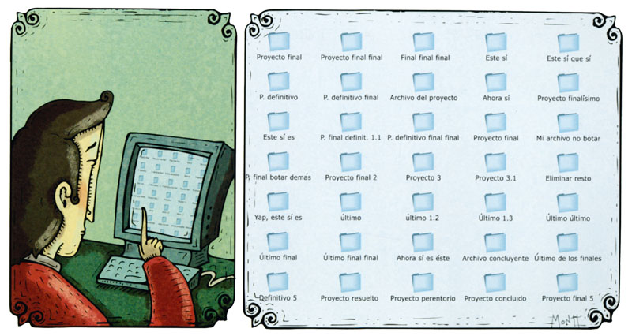

La solución a este problema es la utilización de un sistema de control de versiones, **VCS** por sus siglas en inglés (Version Control System). La idea central de un VCS es almacenar todos los cambios que se realizaron sobre un conjunto de archivos, generando así un historial de cambios, donde se puede ver cada modificación realizada en los archivos, y llegado el caso volver a una versión previa. 

Hay una infinidad de VCS diferentes, con diferentes características que los diferencian, por ejemplo, por nombrar algunos: SVN, Mercurial, Git, Bazaar, Perforce, Team Foundation, Bitkeeper. Dentro de un los diferentes sistemas hay varios conceptos básicos que son comunes a la mayoría:

- **Commit o Parche**: Detalle de un cambio específico que se realizó a uno o más archivos bajo control de versiones. Tiene un autor asociado, una fecha y un comentario donde generalmente se describe que se cambió.
- **Repositorio**: Lugar donde se almacenan todo el historial de cambios. Al trabajar con varios desarrolladores generalmente hay un repositorio compartido donde los diferentes programadores van subiendo sus cambios.
- **Copia de trabajo**: Copia de los archivos bajo control de versiones, generalmente una carpeta, donde un programador hace los cambios en los archivos del proyecto y desde donde se generan los parches que van evolucionando el proyecto.

## Git 

Hoy en día, Git es, con diferencia, el sistema de control de versiones moderno más utilizado del mundo. Git es un proyecto de código abierto maduro y con un mantenimiento activo.

### Historia, filosofía básica

Git nace luego de que una disputa entre los desarrolladores del Kernel de Linux y la empresa propietaria de BitKeeper (el VCS que estaban utilizando en ese momento) dejara a los primeros sin permiso de uso gratuito para este software. Siendo el Kernel de Linux un proyecto de un tamaño considerable, y al no contar con una alternativa gratuita a BitKeeper que satisfaciera todos los desafíos de su desarrollo, Linux Torvalds (el creador de Linux) decide emprender el desarrollo de un VCS propio al que llamó Git.

Un concepto importante para comprender es que Git trabaja de una manera *distribuída*, esto significa que los archivos, su información e historial no están almacenados en un único lugar sino que cada programador al descargar (*clonar*) el repositorio genera una copia local todos los archivos, incluyendo su información e historial. La información sobre los archivos, su contenido y su historial es gestionada por Git en una base de datos local que reside en una carpeta oculta llamada ".git". 

Una consecuencia del modo de trabajo mencionado es que cada programador tiene localmente una copia de todo el contenido del repositorio, lo que le permite trabajar con pocas restricciones, incluso, si no cuenta con conexión al servidor compartido con el resto del equipo. Otra consecuencia de la naturaleza distribuída de Git es que ante un problema el servidor compartido donde haya pérdida de datos del repositorio, el mismo podría restaurarse a partir de las múltiples copias que existen en las computadoras de los distintos programadores o colaboradores del proyecto.

### Evitando confusiones

Antes de continuar se debe aclarar que es común escuchar, de la mano de Git, el término "GitHub". Simplemente se mencionará aquí que mientras que Git es el VCS, GitHub es un servicio muy popular que permite crear repositorios Git en sus servidores.
Algo similar sucede con Gitlab, Gogs o Bitbucket, que, al igual que Github, son otros servicios que permiten almacenar un repositorio en un servidor en internet, además de varias funcionalidades adicionales.
En la asignatura usaremos Gitlab.

### Conceptos básicos para trabajar Git

Como se mencionó anteriormente, un VCS (en este caso Git) permite almacenar todos los cambios realizados sobre un conjunto de archivos manteniendo su historial y permitiendo ver (o restaurar) las versiones previas de estos archivos. No existen restricciones respecto al tipo de archivos con los que Git puede trabajar.

Teniendo en mente cual es el rol que cumple Git en el trabajo diario de un programador el próximo paso será comprender algunos conceptos claves para su utilización. Típicamente, cuando un programador participe en un proyecto de desarrollo de software descargará (*clonará*) desde el servidor compartido el repositorio con los archivos del mismo, generando una copia local sobre la que trabajará. Este escenario se describe en la siguiente figura:

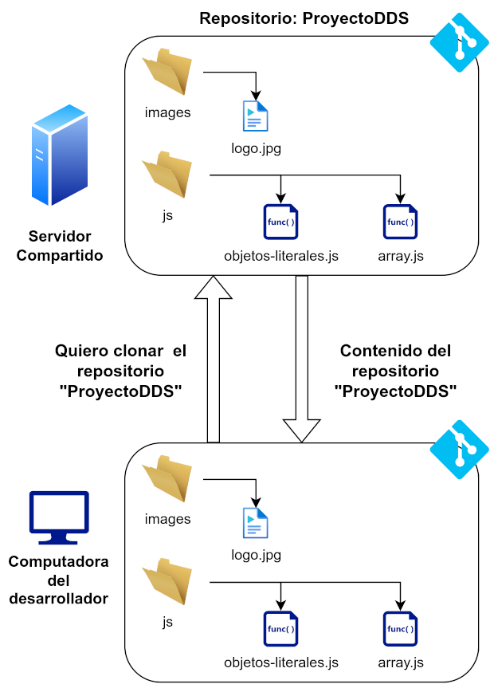

Una vez que el programador haya descargado (*clonado*) el repositorio trabajará sobre esta copia local agregando, modificando y eliminando archivos. Es de importancia aclarar una vez más que estas modificaciones el programador las estará realizando sobre su copia local. 

¿Cómo funcionará, entonces, el control de versiones en Git?, ¿Cada vez que se modifique un archivo (por mínimo que sea el cambio) ¿Se generará una nueva versión?, ¿Cuando se genere una nueva versión, se comunicará automáticamente el cambio al servidor compartido?. Para responder estas preguntas debe entenderse que para Git los archivos estarán en uno de tres estados posibles: *modificado*, *en staging (staged)*, *confirmado (commited)*.

- **Modificado**: El archivo estará en este estado si, luego de haber sido descargado, se modificó. Por ejemplo, se clonó el proyecto *ProyectoDDS*, se abrió con un editor *array.js* y se modificó una línea de código y esta modificación se guardó. Hasta este momento, para Git el archivo está en estado *modificado*, no se confirmó todavía este cambio, no se lo asoció a un autor, ni se guardó este cambio en el historial.

- **Staged**: El archivo estará en este estado si el programador decidió agregar sus modificaciones para que sean confirmadas en el próximo *commit*. Por ejemplo, el programador decide que la modificación al archivo *array.js* es correcta e indicó a Git (de una manera que se detallará más adelante) que este cambio formará parte del próximo *commit* que realice. Debe notarse que si se realizó un cambio sobre algún archivo y este cambio no fué pasado al área de staging el mismo **no** se incluirá en el próximo commit.

- **Commited**: El archivo estará en este estado si el programador confirmó el cambio sobre el mismo (realizó un *commit*). Cuando un archivo pasa a este estado Git creará en su base de datos la nueva versión del archivo, registrará el autor del cambio y el comentario que el mismo ingresó, además de otras varias acciones. Nuevamente, estas acciones ocurren sobre la **copia local** del repositorio y **no** se comunican al servidor compartido. Para enviar los cambios realizados en un *commit* al servidor compartido, debe realizarse un paso adicional que se analizará más adelante.

La siguiente figura muestra un ejemplo de transición entre estos estados:

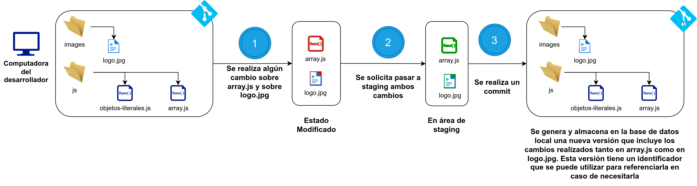

## ¿Línea de comandos o Interfaz gráfica? 

Git en sí es una utilidad de consola, que se utiliza escribiendo comandos a través de una línea de comandos (cmd o git bash en Windows, una terminal en Mac o Linux). Si bien hay una gran cantidad de herramientas gráficas que permiten manejar un repositorio, o integración de Git en los propios IDE, en última instancia estas herramientas terminan ejecutando los comandos de Git por detrás. 

Si bien las interfaces gráficas son muy útiles para navegar por el historial de un repositorio, o simplificar el manejo, es buena idea, al empezar con Git, conocer la interfaz de comandos para entender plenamente como funciona.

En Windows, al instalar Git, se instala también una aplicación llamada **git bash**, que no es nada mas que un emulador de terminal unix, que tiene la capacidad de ejecutar comandos de una terminal unix y los comandos de Git. 

## Instalación de Git

Instalación de git

“Git” es un cliente de Git que nos permite acceder desde la línea de comandos de cualquier terminal a las funcionalidades brindadas por dicho sistema de versionado. También instala su propia terminal llamada Git Bash. Además, trae un GUI Client muy sencillo y básico.
En el sitio oficial de Git https://git-scm.com/ se puede acceder a la opción Descargas o Download para acceder los instaladores y a las instrucciones de instalación.

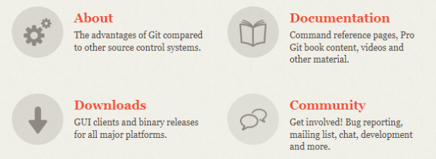

En el caso de Windows: Detecta automáticamente el sistema operativo y en el caso de Windows inicia la descarga automáticamente. En caso de que no inicie la descarga automáticamente seleccionar "Standalone installer".

Seleccionar 32-bit Git for Windows Setup o 64-bit Git for Windows Setup según corresponda.

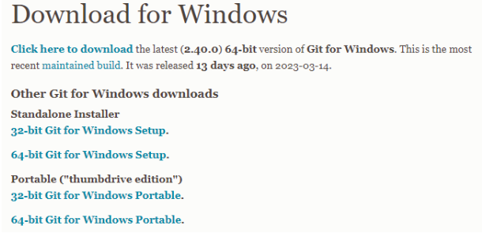

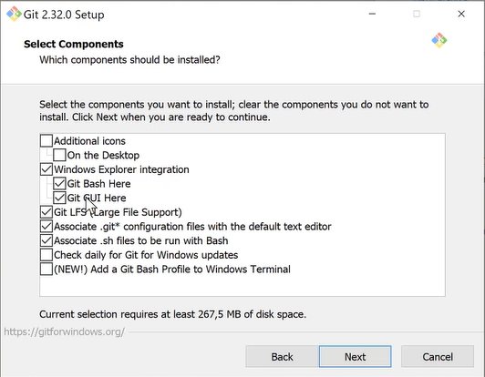

En el caso de Linux:
Debian/Ubuntu
Para obtener la última versión estable para su lanzamiento de Debian/Ubuntu ejecutar:
apt-get install git
Para Ubuntu, este PPA (Personal Package Archive - repositorio de software) proporciona la última versión ascendente estable de Git.
add-apt-repository ppa:git-core/ppa # apt update; apt install git

En el caso de Mac:
Homebrew
Instalar homebrew y luego ejecutar:
$ brew install git

MacPorts
Install MacPorts y luego ejecutar:
$ sudo port install git

## Configuraciones globales
Luego de haber instalado algún cliente de GIT en nuestro equipo, debemos realizar mínimamente las siguientes dos configuraciones:

git config --global user.name "TU NOMBRE"

git config --global user.email "TU DIRECCION DE EMAIL"

Para comprobar tu dirección de correo electrónico:
git config --global user.email

Para comprobar tu nombre:
git config --global user.name

Para ver todas tus entradas en la vista general, se usa este comando:
git config --global --list

Para acceder a la ayuda:
git help

## Obteniendo un repositorio

### ¿Qué es un repositorio?
Un repositorio es un espacio, en la nube, que tenemos asignado para poder alojar todos los archivos de nuestro proyecto. Un repositorio es el lugar donde van a estar todos los commits que forman parte del historial del proyecto.

### Cuentas gitLab
-En el laboratorio se ha creado una cuenta para cada alumno para usar en el contexto de la asignatura:
Ejemplo: 22222@sistemas.frc.utn.edu.ar
-Cada alumno ha recibido un correo en la bandeja del correo institucional.
-Para cambiar la contraseña pueden seleccionar olvidé contraseña en el login de gitLab:
https://labsys.frc.utn.edu.ar/gitlab/desarrollo-de-software1
-Ante algún problema en particular solo la configuración de la cuenta podes contactar a la profesora a nzea@frc.utn.edu.ar

### Creando un repositorio en la nube
Un proyecto en GitLab se corresponde con un repositorio Git. Cada proyecto pertenece a un espacio de nombres, bien sea de usuario o de grupo.
Para crear un repositorio remoto o proyecto debemos contar con una cuenta gitLab y autenticarte.

Ingresa a: https://labsys.frc.utn.edu.ar/gitlab/desarrollo-de-software1 y completá usuario y contraseña:

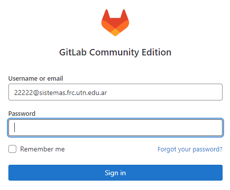

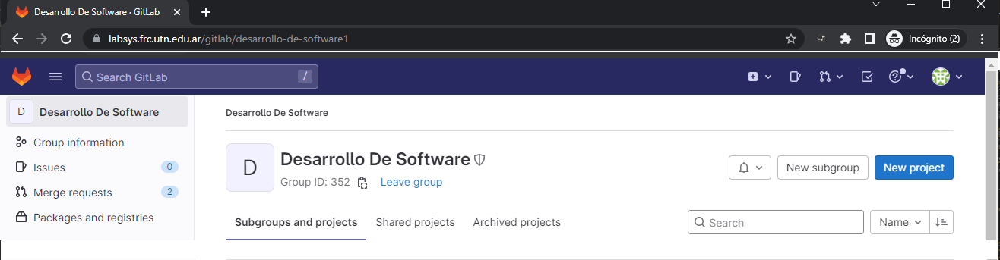

Una vez ingresadas las credenciales es posible acceder a los repositorios a los que tengas acceso o bien crear un nuevo proyecto o repositorio presionando el botón "Nuevo Proyecto" - "Proyecto Vacío" - Crear Proyecto

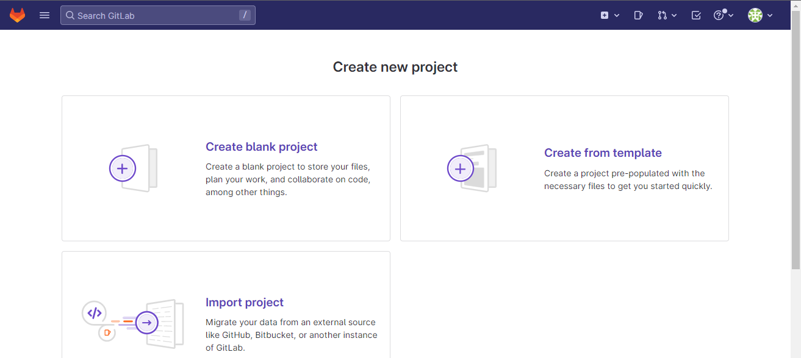

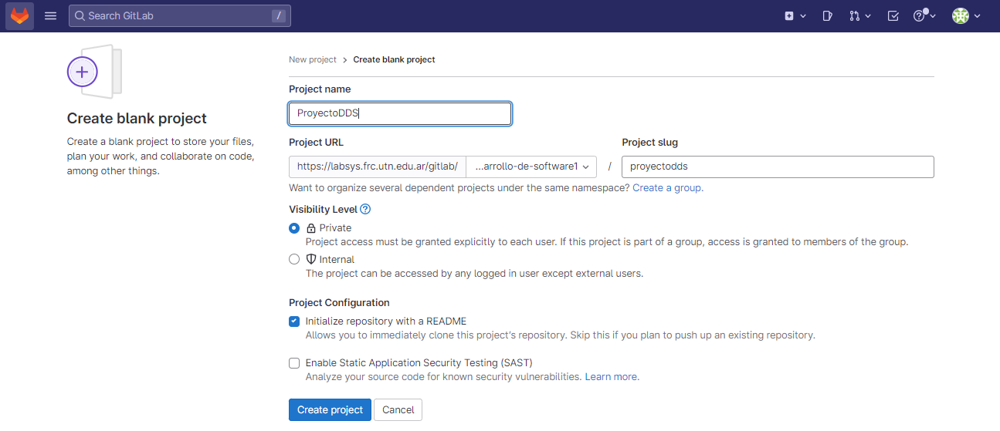

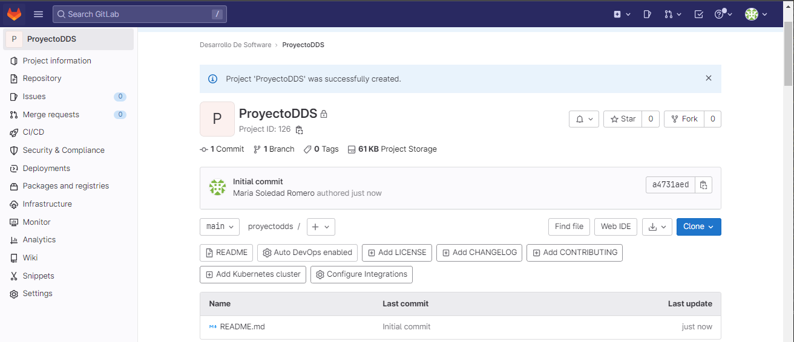

Tenemos en este punto un proyecto que contiene un archivo readme.md y este es el primer commit automático.

### Diferencia entre repositorio local y remoto
GIT trabaja con un repositorio local que está en nuestro equipo, donde iremos agregando nuestros commits.

También trabaja con uno remoto en el cual podemos subir nuestros commits o del cual podemos bajarnos los commits que haya subido alguien
Al empezar a trabajar en un proyecto se suelen dar dos situaciones: o es un proyecto nuevo, o se arranca desde algo existente. Uno puede empezar un proyecto creando un repositorio nuevo, pero como lo mas normal hoy en día es usar algún servicio de hosting de repositorios, en general lo que uno primero hace es *clonar* un repositorio.

Clonar un repositorio consiste en copiar todo el historial de cambios y archivos de la copia de trabajo desde un repositorio remoto. El repositorio desde donde se clona puede estar ubicado en un servidor, o en otra carpeta del sistema de archivos de la misma máquina.

Para esto se utiliza el comando **git clone**. Este comando tiene la siguiente sintaxis: 

`git clone {URL} {destino}`

Donde *URL* es la url del repositorio, que puede ser de diferentes tipos dependiendo de donde esté el repositorio:

- Una dirección de un sitio web, usando protocolo https: https://labsys.frc.utn.edu.ar/gitlab/desarrollo-de-software1/proyectodds.git
  
- Un repositorio accedido via SSH, usando claves pública/privada para autenticación: 22222@labsys.frc.utn.edu.ar:gitlab/desarrollo-de-software1/proyectodds.git donde se indica usuario, servidor y ruta del repositorio usuario@servidor:/ruta.git

- Una carpeta en el sistema de archivos local: C:\Users\Usuario\Proyectos\vscode (Windows) o /home/usuario/proyectos/vscode (Linux). Se usa para copiar un repositorio ya creado o eliminado y pegarlo en la carpeta.
  
  Ejemplo: git clone /ruta/a/repositorio/original destino

Y donde *destino* es el nombre de la carpeta que se va a crear con el contenido del repositorio. Si este parámetro no se indica, se usa el nombre del repositorio como nombre de la carpeta.

Una vez finalizado el proceso, lo que se va a obtener es una carpeta, con el nombre indicado, que contiene dentro todo los archivos del repositorio y una carpeta oculta, llamada .git, que contiene los archivos usados por git para guardar todo el historial de cambios.

Para clonar el repositorio mencionado en la carpeta destinada a tal efecto ejecutamos git clone seguido de la url del repositorio

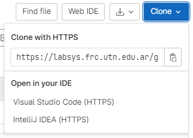

Nos movemos a la carpeta donde deseamos clonar el proyecto (cd C:\vcode\desarrollo_software)

Usando la consola gitbash clonamos el repositorio

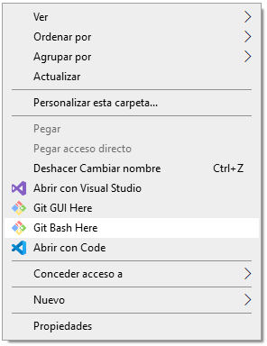

git clone https://labsys.frc.utn.edu.ar/gitlab/desarrollo-de-software1/proyectodds.git

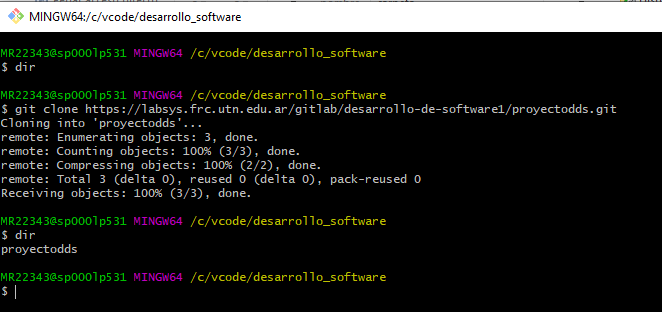

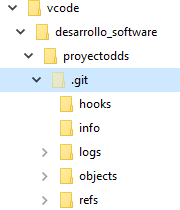

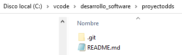

El proyecto clonado por defecto se encuentra en la rama "main"

Las ramas en git son una división del estado del código, esto permite crear nuevos caminos a favor de la evolución del código. Por el contrario, las ramas en Git son parte diaria del desarrollo, son una guía instantánea para los cambios realizados.

## Trayendo cambios del repositorio remoto al repositorio local

`git pull`
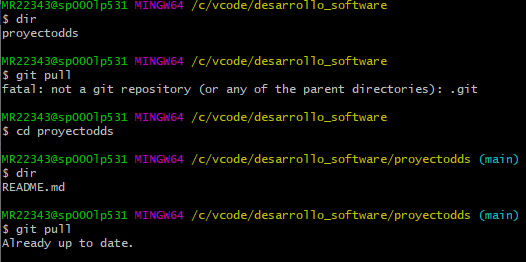

Para traerse los cambios del repositorio remoto al repositorio local es necesario moverse a la carpeta del proyecto y luego ejecutar el comando git pull. La leyenda "Already up to date" indica que el repositorio remoto y el repositorio local están sincronizados.

## Agregando archivos (comandos git status y git add)

Una de las actividades mas frecuentes es agregar archivos o modificarlos. Agrego una de las carpetas de trabajo de las primeras semanas de la asignatura, las carpetas "images" y "js" a la carpeta del proyecto.
El comando git status permite ver si se realizaron cambios aun no confirmados (o commiteados). Debe ejecutarse en una terminal situados en la raíz de un repositorio clonado (o descargado).

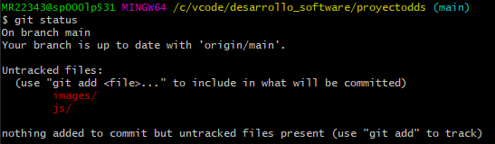

Git usa lo que conocemos como área de staging o "staging area". ¿Qué es la staging area?, básicamente Git administra de forma separada los cambios que se quieren guardar en un commit, lo que permite, si en un archivo hay varias modificaciones, sólo hacer commit de alguna de estas. Lo mas normal es agregar todo lo modificado a la staging area y ahí hacer el commit, en vez de agregar de a pedazos el cambio.

Git permite agregar uno o varios archivos al área de staging (repositorio local), para que luego éstos sean commiteados (en un mismo commit) y subidos al repositorio remoto. Para agregar los archivos usamos el comando git add <filename> o bien git add . para agregar un conjunto de archivos y/o carpetas. Debe ejecutarse en una terminal situados en la raíz de un repositorio clonado (o descargado).

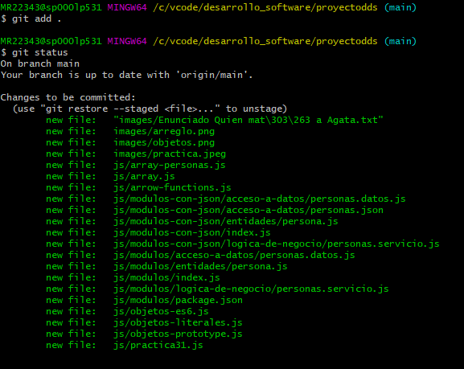

## Creando commits

Git mantiene un historial de los cambios realizados en los archivos del proyecto mediante commits. Un commit es un cambio específido donde se registra, autor, fecha, los cambios de los archivos en si, y un mensaje donde el programador detalla el cambio realizado.

Para crear un commit lo primero es realizar los cambios en los archivos del proyecto, o agregar un archivo nuevo y luego agregar esos cambios a la *staging area*.

Acabamos de dejar cambios en la staging area. Para enviarlos al repositorio remoto es preciso usar el comando commit.

git commit –m ‘mensaje’

Debe ejecutarse en una terminal situados en la raíz de un repositorio clonado (o descargado). Debe considerarse que un commit es un “punto de cambio del proyecto”, situado cronológicamente.

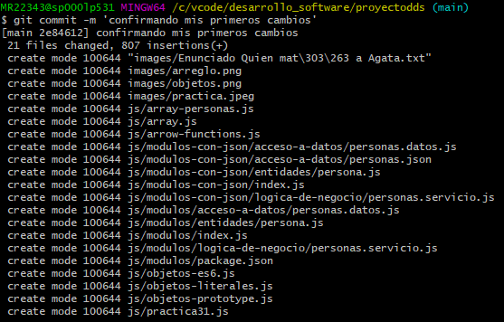

## Analizando diferencias

`git diff`

`git diff {archivo}`

Si se usa sin parámetros muestra los cambios en todos los archivos que no están en la staging area. Si se le pasa un archivo muestra los cambios de dicho archivo. Las líneas que tienen un signo menos adelante son aquellas que fueron eliminadas y las que tienen un signo mas fueron agregadas.

## Enviando cambios del repositorio local al repositorio remoto

Para subir los commits realizados en nuestro repositorio local al repositorio remoto para que éstos puedan ser descargados por el resto del equipo de trabajo usamos git push.

git push <remote> <branch>

Debe ejecutarse en una terminal situados en la raíz de un repositorio clonado (o descargado).

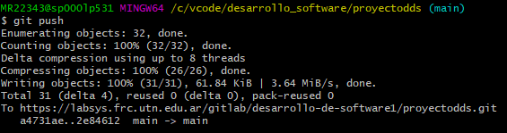

Y los cambios ya están en el repositorio remoto:

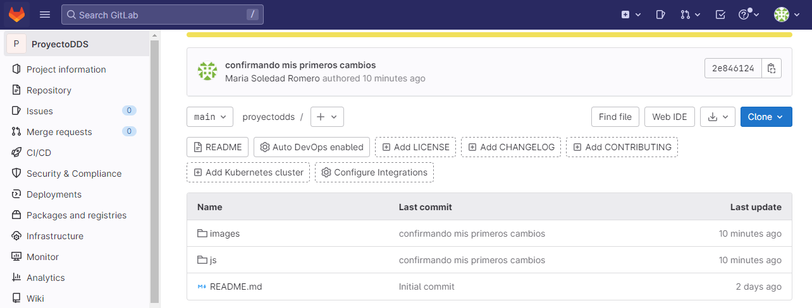

## ¿Cómo agregar colaboradores o miembros al repositorio?

GitLab dispone de distintos niveles de permisos para trabajar con el repositorio.
Desde la opción Members se puede visualizar los colaboradores actuales.

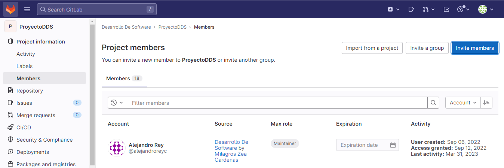

También presionando el botón "Invite Members" se puede invitar a nuevos colaboradores.

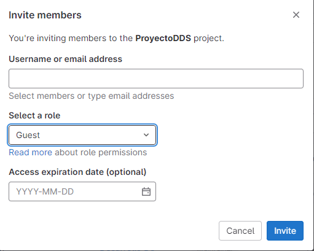

## ¿Qué es gitignore?

Cuando estamos trabajando en un repositorio local, Git observa cada archivo y lo considera de tres maneras:

Seguimiento: ya ha preparado o confirmado el archivo.
Sin seguimiento: no ha organizado ni comprometido.
Ignorado: Le has dicho explícitamente a Git que ignore los archivos.

El archivo .gitignore le dice a Git qué archivos ignorar al enviar su proyecto al repositorio de GitLab. gitignore se encuentra en el directorio raíz de tu repositorio.

El archivo .gitignore en sí es un documento de texto sin formato. Aquí hay un ejemplo de archivo .gitignore:

# IDE - VSCode

.vscode/*
!.vscode/settings.json
!.vscode/tasks.json
!.vscode/launch.json
!.vscode/extensions.json

## Herramientas gráficas

Usamos Visual Studio Code como IDE. Cuenta con una interfaz gráfica que permite ejecutar los mismos comandos git que hemos visto.
Seleccionando "File" - "Open folder" podemos abrir el repositorio local:

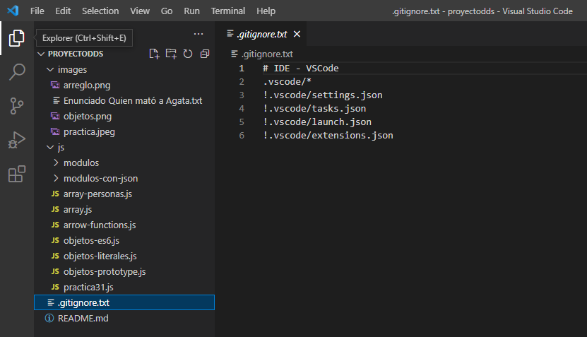

Por ejemplo si agrego una línea en el archivo .gitignore y un cambio una letra en el archivo objetos-literales, son dos archivos modificados, se reflejan con un 2 en la barra de la izquierda

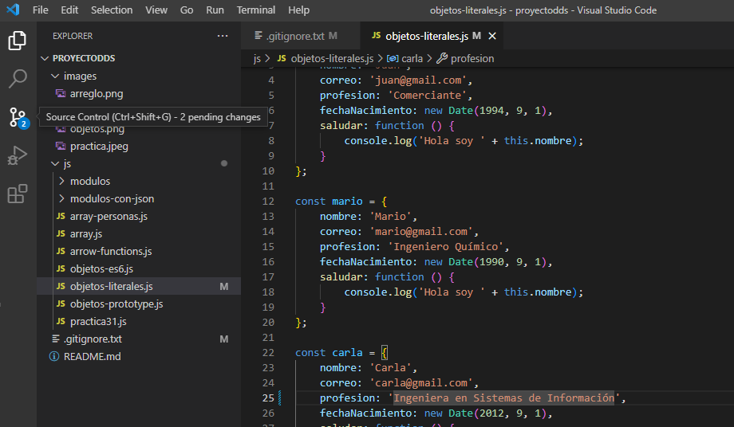

Desde el IDE también puedo commitear los cambios:

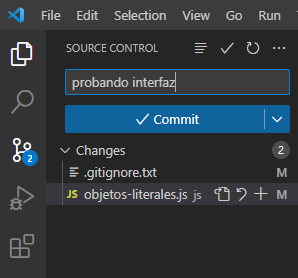

Desde el IDE puedo ejecutar todos los comandos relativos a control de versiones que hemos visto y muchos mas:

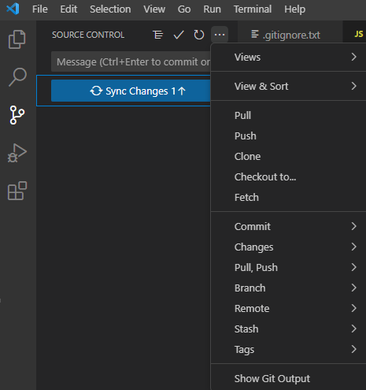

### Resolución de conflictos

Los conflictos ocurren cuando dos colaboradores del repositorio modifican la misma línea. Es una situación muy común cuando trabajamos en grupo.

Para ejemplificar dos miembros del repositorio modificaron la misma línea en el archivo array.js.

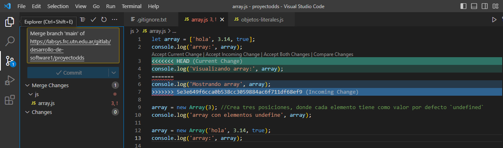

Un usuario escribió "Mostrando array" y otro "Visualizando array". Git no sabe qué cambio dejar y por eso se genera un conflicto. El marcador "<<<<<<<<<<< HEAD         >>>>>>>>>>>" indica donde comienza y termina el conflicto.

Para corregirlo es preciso que te comuniques con el otro colaborador y decidan qué linea dejar. Manualmente se quita el marcador "<<<<<<<<<<< HEAD         >>>>>>>>>>>" y se deja la línea con el cambio final.

Para que este cambio sea efectivo se debe ejecutar:
git pull (traerse cambios)
editar array.js (quitar marcas y dejar la línea definitiva)
git add "array.js"
git commmit -m "resolviendo conflicto"
git push (enviar cambios)

## Git Avanzado - Deshacer cambios

Ocasionalmente se realizan cambios no satisfactorios o deseados y que se prefiere que no queden almacenados en el historial. Cuando se detectan los mismos es necesario volver atrás tales modificaciones. Los comandos para estas acciones dependen del estado del o de los archivos que se intentan manipular.

En el caso más general el comando para deshacer es `git restore`.

### Archivos en área de staging

Si el cambio que se requiere deshacer corresponde a archivos ya agregados al área de staging debe ejecutarse el comando

`git restore --staged archivo`

Este comando únicamente extrae el archivo desde el área de staging, sin modificar su contenido. Los cambios que se hayan realizado en el archivo siguen intactos, pero con el archivo en el estado modificado.

### Archivos modificados

Si adicionalmente se requiere volver atrás cambios no confirmados y cuyos archivos no estén en el área de staging el comando necesario es:

`git restore archivo`

Esta operación sí es destructiva: el contenido del archivo vuelve al estado del último commit.

Asimismo es destacable que sólo funciona si el archivo ya fue incluido en algún commit anterior. Si es un archivo completamente nuevo y se intenta volver atrás con restore se recibirá un error indicando que dicho archivo no es conocido por git. Y esto es razonable, si el archivo es nuevo no tiene ninguna entrada en el historial y por lo tanto no hay commit anterior para recuperar algún estado. En esta situación la única vuelta atrás posible es la de borrar el archivo con los comandos del sistema operativo, `del` o `rm`.

## Ramas 

Cuando manejas muy bien los comandos git básicos podes adentrarte en el uso de ramas:
Una rama de desarrollo (“Git Branch”) es una bifurcación del estado del código que crea un nuevo camino para la evolución del mismo. Puede ir en paralelo a otras Git Branch que se pueden generar. Permite incorporar nuevas funcionalidades al código de manera ordenada y precisa.

Usar las ramas de desarrollo de Git tiene múltiples ventajas. Las mas importantes: 
-Hace posible desarrollar nuevas funciones para una aplicación sin obstaculizar el desarrollo de la rama principal.
-Es posible crear diferentes ramas de desarrollo que pueden converger en el mismo repositorio. Por ejemplo, una rama estable, una rama de prueba y una rama inestable.

Comando Git Branch

En cualquier proyecto Git pudes ver todas las ramas ingresando el siguiente comando en la línea de comando:

git branch
Si no has creado una rama antes, no verás ningún resultado en el terminal. 

Crear una rama es simple:

git branch [nueva_rama]

Luego, tienes que pasar a la rama de desarrollo recién creada. Para hacer esto, ejecuta el siguiente comando:

git checkout [nueva_rama]

La salida te informará que cambiaste a una nueva rama. Para el ejemplo, digamos que llamamos a esta rama “prueba”, entonces será:

Switched to branch ‘prueba’
Ahora, en esa nueva rama de desarrollo, puedes crear tantas modificaciones de código como quieras, sin tener que cambiar nada en la principal. Como puedes ver, el programa se mantendrá organizado para nuevas inclusiones de código.

Si ejecutas el comando para volver a listar las ramas, verás que se agrega una nueva rama y que estás en ella.

git branch
Hay algo que debes tener en cuenta si quieres crear una nueva rama de desarrollo. Primero, debes comprometerla con la rama principal para que Git entienda cuál es la rama maestra. Si no haces esto, obtendrás un error. Primero, crea el enlace y luego crea las ramas de desarrollo.

Si quieres eliminar una rama de Git, puedes hacerlo con el siguiente comando:

git branch -d [nombre_de_ rama]
Sin embargo, para hacer esto, no debes estar en la rama que quieres eliminar. Entonces, en este caso, te mueves a la rama maestra y desde allí eliminas la rama que acabas de crear:

git checkout master
git branch -d test
Finalmente, llega un punto en el que has realizado muchas modificaciones en una rama de desarrollo. Y se vuelve estable, por lo que quieres vincularla a otra rama de desarrollo. Para eso, existe el comando merge (fusión).

Primero, ubica la rama de desarrollo a la que se adjuntará la segunda rama. Por ejemplo, adjuntaremos la rama de prueba a la rama maestra. Luego, debemos ubicarnos en la rama maestra y fusionar usando el comando:

git merge [rama]
Como puedes ver, las funciones básicas Git Branch son bastante sencillas. Solo necesitas conocer los fundamentos e intentar mantener limpia tu administración.

## Bibliografía

- Git Book: https://git-scm.com/book/es/v2
- Gitignore para proyectos javascript: https://gist.github.com/andreasonny83/b24e38b7772a3ea362d8e8d238d5a7bc
- Usos y definición de git branch: https://www.hostinger.es/tutoriales/como-usar-git-branch
