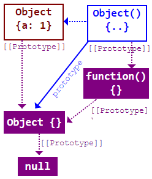
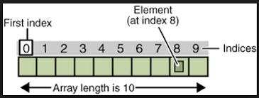

 

# Apunte 07 - JavaScritpt parte II

## ¿Qué es un objeto en JS?

Un objeto es una colección de propiedades.

Toda propiedad es una asociación entre un nombre (o _**clave**_) y un **valor**. El valor de una propiedad puede ser una variable (o expresión constante), o una función. En el caso que la propiedad tiene por valor una función, hablamos de **método**.

JavaScript es un lenguaje de objetos basado en **prototipos**, donde los objetos heredan de otros objetos y en última instancia del prototipo de **Object** (`Object {}`).



Además de los objetos predefinidos de JS, es posible definir otros objetos.
Éstos se pueden crear utilizando **notación literal**, o bien mediante **new Object()** o **funciones constructoras**.

### Propiedades (*)

Un objeto de JavaScript tiene propiedades asociadas a él. Una propiedad de un objeto se puede pensar como una variable adjunta a dicho objeto.  Las propiedades de un objeto definen sus características y se pueden acceder mediante:

- Notación de punto:

```js
objeto.propiedad
```

- Notación de corchetes:

```js
objeto['propiedad']
```

Una vez definido un objeto es posible crear (agregar) nuevas propiedades. Por ejemplo:

```js
persona.pais = 'Argentina'
```

Las propiedades no asignadas de un objeto son [`undefined`]

```js
persona.fechaNacimiento; // undefined
```

El nombre de la propiedad de un objeto puede ser cualquier cadena válida de JavaScript, o cualquier cosa que se pueda convertir en una cadena, incluyendo una cadena vacía. Sin embargo, cualquier nombre de propiedad que no sea un identificador válido de JavaScript (por ejemplo, el nombre de alguna propiedad que tenga un espacio o un guión, o comience con un número) solo se puede acceder utilizando la notación de corchetes. Esta notación es muy útil también cuando los nombres de propiedades son determinados dinámicamente (cuando el nombre de la propiedad no se determina hasta el tiempo de ejecución).

## Creación de objetos

### Creación de objetos con notación literal (*)

Cuando se utiliza la notación de llaves nos referimos a **notación literal**.
Éstos se crean a partir de un juego de llaves **{}**
Vamos con un ejemplo:

```js
    const juan = {
        nombre: 'Juan',
        correo: 'juan@gmail.com',
        profesion: 'Comerciante',
        fechaNacimiento: new Date(1994, 9, 1),
        saludar: function () {
            console.log('Hola soy ' + this.nombre);
         }
    };
```

>Nota:
>
>La palabra reservada **this** en el contexto de los objetos, refiere al **objeto actual**. En los contextos de funciones permite referenciar al objeto **Window** (cuando estamos ejecutando código JS en un navegador).
>

Hay más ejemplos en el archivo [objetos-literales.js](js/objetos-literales.js), ejecutando con

```powershell
nodejs js/objetos-literales.js #ruta al archivo a ejecutar 
```

Ademas tenemos otras dos formas de instanciar un objeto, utilizando el operador `new Object()` o a través de un `constructor de funciones`.

### Creación de objetos con new Object

Utilizando el ejemplo anterior y el operador `new Object()`, también se podría reescribir la creación del objeto persona:

```js
  const persona = new Object();
    persona.nombre = 'Juan';
    persona.correo = 'juan@gmail.com';
    persona.profesion =  'Comerciante';
    persona.saludar = function(){
      console.log('Hola soy ' + this.nombre)
    };
```

### Creación de objetos con función constructora

Estas nos permiten crear nuevos tipos de objetos definidos por nosotros.
Como alternativa, es posible crear un objeto con estos dos pasos:

1. Definir el tipo de objeto escribiendo una función constructora. Existe una fuerte convención para utilizar en mayúscula la letra inicial.
2. Crear una instancia del objeto con el operador  `new`.

Para definir un tipo de objeto, crea una función para el objeto que especifique su nombre, propiedades y métodos.
Por ejemplo, supongamos que se desea crear un tipo de objeto para el ejemplo anterior.
Es decir un objeto de tipo `Persona`  con las siguientes propiedades:  `nombre`,  `correo`,  `profesion`  y  `saludar`.
Para ello, escribir un ejemplo en el archivo [objetos-prototype.js](./js/objetos-prototype.js)

```js
function Persona(nombre, correo, profesion, fechaNacimiento) {
    this.nombre = nombre;
    this.correo = correo;
    this.profesion = profesion;
    this.fechaNacimiento = fechaNacimiento;
    this.saludar = function () {
        console.log('Hola soy ' + this.nombre);
    };
    this.edad = function () {
        const hoy = new Date();
        return hoy.getFullYear() - this.fechaNacimiento.getFullYear();
    };
}
```

y lo vamos a ejecutar con nodejs:

```powershell
nodejs ./js/objetos-prototype.js #ruta al archivo a ejecutar 
```

Observar que el operador  `this`  se utiliza para asignar valores a las propiedades del objeto en función de los valores pasados a la función.

Para crear un objeto llamado **persona** mediante la función constructora escribir:

```js
    const persona = new Persona('Juan', 'juan@gmail,com', 'Comerciante');
```

Esta declaración crea  `persona`  y le asigna los valores especificados a sus propiedades. Entonces el valor de  `persona.nombre`  es la cadena "Juan", para  `persona.correo`  es "<juan@gmail.com>", y así sucesivamente.

### ¿Y prototype?

Es importante recordar que javascript es un lenguaje basado en prototipos, en donde todos los objetos terminan heredando
de `Object` y `prototype` nos permite agregar nuevos metodos a los contructores de los nuevos tipos de objetos que hayamos definido.

Por ejemplo:

```powershell
nodejs ./js/objetos-prototype.js #ver ejemplo con protopye
```

Al utilizar `prototype` estamos afectando a todas las instancias del tipo de objeto en cuestión. En el ejemplo de `Persona`
vemos que al manipular el resultado de la función `esMayorDeEdad` este te se modifica para todas las instancias.

```js
Persona.prototype.esMayorDeEdad = function () {
    // if (this.edad() > 18)
    //     return true;
    // return false
    return this.edad() > 18;
};
```

Si en lugar de modificar Persona, modificamos una instancia, por ejemplo `carla`

```js
carla.__proto__.esMayorDeEdad = function () {
    return false;
};
```

vemos que tambíen afecta a `mario`. Considerar que para acceder a `prototype` por medio de la instancia, es necesario
accederlo a través de la propiedad `__proto__`.

### ECMAScript 6 y la palabra resevada *class*

Ahora con la sintaxis de **ECMAScript (ES6)**, se puede usar la palabra `class` para definir un tipo de objeto.
Esta sintaxis implicitamente define objetos por medio de funciones constructoras, ya que el concepto de clases
no existe en JS y la creación de objetos se termina haciendo a través de prototype. Lo que realmente nos facilita ES6
es una sintaxis amigable conocida como `syntactic sugar` o `lenguaje más dulce` para los programadores.

Ejemplo en archivo [objetos-es6.js](js/objetos-es6.js)

```js
class Persona {

    constructor(nombre, correo, profesion, fechaNacimiento) {
        this.nombre = nombre;
        this.correo = correo;
        this.profesion = profesion;
        this.fechaNacimiento = fechaNacimiento;
    }

    saludar() {
        console.log('Hola soy ' + this.nombre);
    }

    edad() {
        const hoy = new Date();
        return hoy.getFullYear() - this.fechaNacimiento.getFullYear();
    }
}
```

```powershell
nodejs js/objetos-es6.js #ver ejemplo con es6
```

Una de las cosas nuevas que aporta ES6 es que al declarar tipos de objetos si o si, es necesario instanciarlos con la
palabra reservada `new` sino lanza un error:

```js
const maria = Persona('María', 'maria@gmail.com', 'Ingeniero en Sistemas de Información', new Date(2012, 9, 1));
// lanza el error: TypeError: Class constructor Persona cannot be invoked without 'new'
```

```powershell
nodejs js/objetos-es6.js #Ver Inicialización de objetos sin new 
```

Ademas algunas características de sintaxis y semantica de ES6 no son compartidas con es5. Por ello es importante tener en cuenta tanto
las versiones de los lenguajes como los estándares.

### 🧬 Entendiendo la relación entre `Object`, `prototype`, nuestras clases y las instancias

JavaScript es un lenguaje orientado a objetos **basado en prototipos**. Eso significa que no hay clases en el sentido tradicional (aunque desde ES6 tenemos la palabra reservada `class`), sino que **todos los objetos heredan de otros objetos**.

A continuación, te mostramos cómo funciona esta cadena de relaciones desde `Object` hasta nuestras instancias, con explicaciones y ejemplos:

#### 🔗 La cadena de prototipos (`Prototype Chain`)

Todo objeto en JavaScript hereda, directa o indirectamente, de `Object`. Esto se da gracias a un mecanismo conocido como **cadena de prototipos**.

```js
class Persona {
    constructor(nombre) {
        this.nombre = nombre;
    }

    saludar() {
        console.log("Hola, soy " + this.nombre);
    }
}

const juan = new Persona("Juan");
```

#### 🧭 ¿Qué pasa internamente?

1. **`juan` es una instancia de `Persona`**
    - Tiene sus propias propiedades (como `nombre`)
    - Su prototipo interno (`[[Prototype]]`) apunta a `Persona.prototype`

2. **`Persona.prototype`**
    - Es un objeto que contiene métodos compartidos (como `saludar`)
    - Es compartido por todas las instancias creadas con `new Persona()`

3. **`Persona.prototype.__proto__`**
    - Apunta a `Object.prototype`, el prototipo base de todos los objetos

4. **`Object.prototype.__proto__`**
    - Es `null`, porque está en la cima de la cadena de herencia

🧪 Visualización de la cadena

```sh
juan (instancia)
   |
   └──→ Persona.prototype
             |
             └──→ Object.prototype
                         |
                         └──→ null
```

🕵️ Explorando con código

```js
juan instanceof Persona; // true
juan instanceof Object;  // true

Object.getPrototypeOf(juan) === Persona.prototype; // true
Object.getPrototypeOf(Persona.prototype) === Object.prototype; // true
```

🧠 ¿Por qué es importante?

- Todo método que no esté en la instancia se busca en su prototipo (prototype)
- Si no se encuentra, se sigue subiendo por la cadena de prototipos
- Permite compartir comportamientos entre instancias sin duplicar código

📌 Buenas prácticas

- Definir métodos compartidos en prototype (o usando class) en lugar de redefinirlos en cada instancia
- Usar `Object.getPrototypeOf()` o `.__proto__` solo con fines de exploración o aprendizaje
- Evitar modificar directamente Object.prototype (puede generar efectos inesperados en todo el entorno)

### 🧱 Resumiendo las formas de crear objetos en JavaScript

A lo largo de este módulo vimos distintas maneras de crear objetos. A continuación se presenta un resumen comparativo entre las principales formas disponibles:

| Forma de creación         | Sintaxis básica                         | Comentario                                                              |
|---------------------------|------------------------------------------|-------------------------------------------------------------------------|
| **Notación literal**      | `const obj = { ... }`                   | La más simple y clara. Ideal para objetos pequeños o estáticos.        |
| **`new Object()`**        | `const obj = new Object()`              | Alternativa más antigua. Equivalente a la notación literal. Poco usada.|
| **Función constructora**  | `function Persona(...) { this.x = ... }`| Permite crear múltiples instancias. Requiere `new`.                    |
| **Prototype + constructor** | `Persona.prototype.saludar = ...`     | Permite definir métodos comunes compartidos por todas las instancias.  |
| **Clase (ES6)**           | `class Persona { constructor(...) { ... } }` | Syntactic sugar de las funciones constructoras con sintaxis más clara. |

> 📌 Todas las formas utilizan `this` para definir propiedades internas.  
> ⚠️ Para crear una instancia, en los casos de función constructora o clase, siempre se debe usar `new`.

## Funciones flecha

### Repaso de funciones

Teniendo en cuenta lo visto en la sección annterior, podemos crear ejemplos para nuestro dominio de Personas, por ejemplo la función `obtenerPersonaMasGrande`
que busca la persona más grande entre tres objetos `Persona` pasados por argumentos [arrow-fucntions.js](js/arrow-functions.js)

```js
obtenerPersonaMasGrande = function (p1, p2, p3) {
    let mayor = p1;
    if (p2.edad() > p1.edad())
        mayor = p2;
    else {
        if (p3.edad() > p1.edad())
            mayor = p3;
    }
    console.log('Soy una function/metodo común. Atte esMayorDeEdad');
    return mayor;
};
```

Podemos reescribirla como `arrow function`:

```js
obtenerPersonaMasGrandeArrow = (p1, p2, p3) => {
    let mayor = p1;
    if (p2.edad() > p1.edad())
        mayor = p2;
    else {
        if (p3.edad() > p1.edad())
            mayor = p3;
    }
    console.log('Soy una arrow function. Atte esMayorDeEdad');
    return mayor;
};
```

Se pude verificar la ejecución con:

```powershell
node js/arrow-functions.js #path a archivo
```

Básicamente las **arrow functions** son otra forma de escribir funciones con una sintaxis más simplificada, lo que normalmente conocemos como **expresadas**.

Existen algunas diferencias con las funciones declaradas y también algunas
limitaciones, tal como se enuncia a continuación:

- No hay que usar **arrow function** cuando se está declarando metodos dentro de una clase o definición de objetos.
- No se puede usar **arrow functions** dentro de constructores.
- Si tienen solo una línea es posible omitir las {} y escribirla en una sola línea
- Si tienen un solo parámetro es posible omitir los ()
- Mediante **this** tienen acceso al contexto de su declaración
- Tienen un return implícito
- Son utilizadas dentro los iteradores de conjuntos

### ⚠️ Advertencia sobre `this` en funciones flecha

Uno de los aspectos más importantes (y a veces confusos) de las **arrow functions** en JavaScript es su comportamiento con respecto a `this`.

#### 🔍 ¿Qué pasa con `this` en arrow functions?

Las **arrow functions no tienen su propio `this`**. En lugar de eso, **capturan el valor de `this` del contexto en el que fueron definidas**. Es decir, **heredan `this` del contexto léxico** (del entorno donde fueron creadas).

#### 🧪 Ejemplo 1: Función tradicional como método

```js
const persona = {
    nombre: "Juan",
    saludar: function () {
        console.log("Hola, soy " + this.nombre);
    },
};

persona.saludar(); // Hola, soy Juan
```

En este caso, this apunta al objeto persona, como se espera.

❌ Ejemplo 2: Arrow function como método

```js
const persona = {
    nombre: "Juan",
    saludar: () => {
        console.log("Hola, soy " + this.nombre);
    },
};

persona.saludar(); // Hola, soy undefined
```

En este caso, this no se refiere a persona, sino al contexto externo (por ejemplo, window en el navegador o global en Node.js).

### ✅ ¿Cuándo usar y cuándo evitar arrow functions?

| Contexto                     | ¿Usar arrow function? | Motivo                                                                 |
|-----------------------------|-----------------------|------------------------------------------------------------------------|
| Funciones dentro de métodos | ❌ No                 | No tienen su propio `this`                                            |
| Métodos de clase            | ❌ No                 | Podés romper la referencia a la instancia                             |
| Callbacks, iteradores       | ✅ Sí                 | Más conciso, no cambia el contexto de `this`                          |
| Funciones puras o utilitarias | ✅ Sí               | No necesitás `this`, sintaxis más limpia                              |

---

### 📌 Reglas simples para recordar

- Si usás `this`, preferí una función **tradicional**.
- Si **no necesitás `this`** (por ejemplo, en un `map`, `filter`, `forEach`), usá **arrow function**.

>Nota
>
> Si bien hay más limitaciones, solo se mencionan éstas ya que se relacionan con los puntos abordados hasta el momento. Para mas info ir a
> [Arrow function expressions](https://developer.mozilla.org/en-US/docs/Web/JavaScript/Reference/Functions/Arrow_functions).

## Arrays o vectores

Un arreglo es un conjunto de datos ordenados por posiciones, asociadas en una variable. Los valores se delimitan por **[]**.
Gráficamente:



Los valores pueden ser del mismo tipo o de distinto tipo. Algunos ejemplos en [array.js](js/array.js):

```js
const array = ['hola', 3.14, true];
console.log('array:', array); // array: [ 'hola', 3.14, true ]
```

```js
const array = new Array(3); // Crea tres posiciones, donde cada elemento tiene como valor por defecto `undefined`
console.log('array con elementos undefine', array); // array con elementos undefine [ <3 empty items> ]
```

```js
const array = new Array('hola', 3.14, true);
console.log('array:', array); // array: [ 'hola', 3.14, true ]
```

### 🧱 Crear arrays en JavaScript

| Forma                  | Ejemplo                                 | Comentario                                                             |
|------------------------|------------------------------------------|------------------------------------------------------------------------|
| Literal                | `const numeros = [1, 2, 3];`             | Recomendado: sintaxis simple, legible y directa                        |
| Constructor `Array`    | `const vacio = new Array(3);`           | Poco clara: crea un array con 3 _espacios vacíos_ (no `undefined`)     |
| Constructor con datos  | `const mezcla = new Array('a', true);`  | Similar al literal, pero menos usado actualmente                      |

> ⚠️ Cuidado: `new Array(3)` no crea `[undefined, undefined, undefined]`, sino un array con 3 "slots vacíos", lo que afecta ciertos métodos (`map`, `forEach`, etc.).

### 🔍 Acceder a los elementos

```js
const frutas = ["manzana", "banana", "naranja"];
console.log(frutas[0]); // manzana
console.log(frutas[2]); // naranja
console.log(frutas[99]); // undefined
```

> 🧠 Recordá que los arrays en JS son 0-indexados (el primer elemento está en el índice 0).

### 🔷 Manipulación de arrays

Para conocer la cantidad de elementos: `array.length`.  
**Importante**: `length` es una propiedad de los array por lo tanto es sin paréntesis.

### 🛠️ Métodos comunes para manipular arrays

| Método      | ¿Modifica el array original? | ¿Qué hace?                                               | Ejemplo                                 |
|-------------|------------------------------|-----------------------------------------------------------|------------------------------------------|
| `push`      | ✅ Sí                        | Agrega al final                                           | `arr.push(5)`                            |
| `pop`       | ✅ Sí                        | Quita el último                                           | `arr.pop()`                              |
| `unshift`   | ✅ Sí                        | Agrega al inicio                                          | `arr.unshift(1)`                         |
| `shift`     | ✅ Sí                        | Quita el primero                                          | `arr.shift()`                            |
| `splice`    | ✅ Sí                        | Inserta, reemplaza o elimina elementos                    | `arr.splice(1, 2)`                       |
| `slice`     | ❌ No                        | Devuelve una copia parcial                               | `arr.slice(0, 2)`                        |
| `map`       | ❌ No                        | Transforma cada elemento                                 | `arr.map(x => x * 2)`                    |
| `filter`    | ❌ No                        | Devuelve solo los que cumplen una condición              | `arr.filter(x => x > 10)`               |
| `forEach`   | ❌ No                        | Itera sobre los elementos (sin devolver array)           | `arr.forEach(x => console.log(x))`      |
| `find`      | ❌ No                        | Devuelve el primer elemento que cumple la condición      | `arr.find(x => x === 10)`               |
| `includes`  | ❌ No                        | Verifica si el array contiene un valor                   | `arr.includes("naranja")`               |

> 📌 Consejo: `map` y `filter` devuelven nuevos arrays sin modificar el original.

Por ejemplo:

```js
const numeros = [1, 35, 6, 54, 13, 3, 24]; // dar nombres representantivos
console.log('array numeros', numeros)
console.log('primer elemento de numeros', numeros[0])
console.log('índice no válido de numeros', numeros[129])
numeros.push(65) // agrego nuevo elemento al final
console.log('nuevo elemento al final de numeros', numeros[7])
numeros.unshift(34) // agrego nuevo elemento al principio de numeros
console.log('nuevo primer elemento de numeros', numeros[0])
console.log(`El array números tiene ${numeros.length} elementos`);
```

> Ejecutar sección `Manipulando arrays` en [array.js](js/array.js#L11)
>
> ```powershell
> nodejs js/array.js #ruta al archivo a ejecutar
> ```

### 🔷 Aplicaciones típicas y patrones

Podemos usar tanto las estructuras iterativas tradicionales o Javascript nos provee de varios [metodos o funciones especiales](https://developer.mozilla.org/es/docs/Web/JavaScript/Reference/Global_Objects/Array) para manipular arrays.  
Entre ellos podemos encontrar:

Dado el siguiente array:

```js
const numeros = [1, 35, 6, 54, 13, 3, 24]; // dar nombres representantivos
```

Podemos ejecutar algunos ejemplos en la sección [Iterando arrays](js/array.js#L25)

🔸 Iterar todos los elemento:  
**forEach**: Recorrer los cada elemento. Como argumento del forEach va una funcion, por ejemplo

```js
numeros.forEach(elemento => console.log(elemento));
```

> Nota:
> En este caso la arrow function `e => console.log(e)` solo imprime por consola lo que le llega por argumento.

🔸 Contar cuántos cumplen una condición:  
**filter**: Filtrar los elementos, devuelve un array nuevo. No modifica el actual.

```js
const mayoresA10 = numeros.filter((e) => e > 10);
console.log(`Mayores a 10`, mayoresA10);
console.log(`Numeros`, numeros);
console.log(`La cantidad de elementos mayores a 10 son ${mayoresA10.length}`);
```

> Nota:
> Notese que la arrow function pasada por parametro a `filter` tiene que retornar `true` para que el elemento e
> sea insertado en el array que se va a retornar.

🔸 Transformar datos:
**map**: Mapea cada elemento del array y genera un array nuevo a partir de cada elemento mapeado. Por ejemplo

```js
const numerosX10 = numeros.map((e) => e * 10);
console.log(`elementos mapeados`, numerosX10);
console.log(`Numeros`, numeros);
console.log(`La cantidad de elementos mayores a 10 son ${numerosX10.length}`);
```

> Todas las funciones especiales ejecutan una función sobre los elementos del array.
> La sintaxis corresponde a funciones flecha.
>
> Notar que la variable auxiliar **e** puede nombrarse como el desarrollador prefiera.

### ⚠️ Errores comunes con arrays

- Acceder a índices inexistentes → `arr[999]` devuelve `undefined`, **no** lanza error.
- Usar `new Array(n)` sin entender que crea "slots vacíos".
- Usar `forEach` esperando que devuelva algo (no lo hace).
- Olvidar que `push`, `pop`, `shift`, `unshift`, `splice` **modifican el array original**.

### ✨ Arrays por comprensión (Experimental, ES2023)

> Similar a Python: una forma compacta de generar arrays. Aún no ampliamente soportado.

```js
// Generar cuadrados del 1 al 5
const cuadrados = [for (x of [1, 2, 3, 4, 5]) x * x];
```

⚠️ Solo disponible en entornos que soporten ECMAScript 2023. No usar en producción sin verificación de compatibilidad.

## 🎁 Empaquetado y Desempaquetado de Objetos y Arrays

JavaScript moderno (desde ES6) nos permite **desempaquetar** propiedades de objetos y elementos de arrays, así como **empaquetar** variables dentro de un objeto con menos sintaxis.  
> Es algo parecido a lo que nos permitína las Tuplas en el Python de AED

### 🧱 Desempaquetado de Objetos (Object Destructuring)

En lugar de acceder una por una a las propiedades de un objeto:

```js
// Notar que en la siguiente línea se está construyendo un a instancia de un objeto con 3 propiedades una llamada nombre, una llamada edad y otra llamada correo
const persona = { nombre: "Juan", edad: 30, correo: "juan@gmail.com" };
const nombre = persona.nombre;
const edad = persona.edad;
```

Podemos usar destructuring para extraerlas en una sola línea:

```js
onst { nombre, edad } = persona;
console.log(nombre); // "Juan"
console.log(edad);   // 30
```

📌 Incluso podemos **Renombrar variables** al desempaquetar y tomar solo las variables que necesitamos de entre las propiedades de los objetos.

```js
const { nombre: nombrePersona } = persona;
console.log(nombrePersona); // "Juan"
```

📌 Y hasta les podemos agregar **Valores por defecto**

```js
const { profesion = "Desconocida" } = persona;
console.log(profesion); // "Desconocida"
```

### 📦 Empaquetado de Objetos (Object Property Shorthand)

Ahora el camino inverso, como vimos en la primera línea del primer ejemplo de este aparatado podemos crear un objeto sin una clase simplemente poniendo entre llaves los nombres de sus propiedades y sus valores. Este esquema da origen a JSON como veremos más adelante.

```js
// Notar que en la siguiente línea se está construyendo un a instancia de un objeto con 3 propiedades una llamada nombre, una llamada edad y otra llamada correo
const persona = { nombre: "Juan", edad: 30, correo: "juan@gmail.com" };
console.log(persona.nombre);
console.log(persona.correo);
```

Cuando los nombres de las variables coinciden con los nombres de las propiedades, podemos usar una sintaxis más corta:

```js
const nombre = "María";
const edad = 28;

// 👇 Equivalente a { nombre: nombre, edad: edad }
const persona = { nombre, edad };
```

> 💡 Esta sintaxis se usa muchísimo al retornar objetos o al definir datos de prueba.

### 🔁 Desempaquetado de Arrays (Array Destructuring)

En el caso de los arrays es aún más parecido a lo que hacíamos con tuplas en Python. Por ejemplo:

```js

const numeros = [10, 20, 30];

const [primero, segundo] = numeros;

console.log(primero); // 10
console.log(segundo); // 20

// 👇 Podemos omitir valores
const [ , , tercero] = numeros;
console.log(tercero); // 30

// 👇 O tomar todos los elementos a partir del seleccionado
const [primero, ...resto] = numeros;
console.log(primero); // 10
console.log(resto);   // [20, 30]
```

## Ejercicios de Práctica

### Ejercitación 1

>Práctica 3.1: Se ha solicitado un script que permita cargar las precipitaciones promedio en cada mes del país (en nuestro caso serán generadas de manea aleatorias con valores comprendidos entre [15;35]º), en base a esos datos determinar:
>
>- el promedio anual de lluvias
>- el promedio de lluvias para el segundo semestre del año
>- el mes más seco del año
   [Práctica 3.1.js](js/practica31.js)

### Ejercitación 2: Personas

> Crear un array con al menos 8 personas. Usar la clase persona previamente definida.
> Definir funciones que reciban como argumento el array vuelvan:
>
> 1- Personas mayores de edad: mayoresDeEdad(personas)
>
> 2- Persona cuya profesión sea una pasada por argumento, ej: personasXProfesion(personas, 'superheroe')
>
> 3- obtenerPersonaMasGrande(personas), tener en cuenta que ahora recibe como argumento un array con n personas.
>
> 4- obtenerProfesiones(personas). // sin duplicados

## Módulos

Como pasa en todos los sistemas de información y en distintos lenguajes el código se va incrementando.
Si desde el principio no se ha definido una estructura a seguir y se ha escrito todo el código en el mismo archivo,
el código escrito deja de ser inteligible, pasando a ser poco mantenible e inflexible a cambios, entre otros.

➡️ **Los módulos permiten organizar el código en archivos separados**, cada uno con un propósito concreto, como:

- 📦 Tipos de datos (clases, estructuras)
- ⚙️ Lógica de negocio (funciones que operan sobre los datos)
- 🧾 Datos iniciales o de prueba

Para dividir el código según cierta "funcionalidad" o enfoque arquitécnico es que javascript nos proporciona
la capacidad de separar en `modulos` nuestro código. Por ejemplo la carpeta modulos tiene la siguiente estructura:

Estructura de [modulos](js/modulos)

```bash
    modulos
    ├── acceso-a-datos
    │   └── personas.datos.js
    ├── entidades
    │   └── persona.js
    ├── logica-de-negocio
    │   └── personas.servicio.js
    ├── index.js
    └── package.json
```

- En `acceso-a-datos` se encuentran los archivos con los datos.
- En `entidades` tiene la definición de los tipos de datos usados.
- En `logica-de-negocio` tiene las funciones necesarias para cumplir con los requerimientos pedidos.

### 📦 ¿Qué es un módulo?

Un módulo en JavaScript es simplemente un **archivo que puede exportar o importar contenido** (funciones, clases, variables, etc.).

```js
// persona.js
export class Persona {
    constructor(nombre) {
        this.nombre = nombre;
    }
    saludar() {
        console.log("Hola, soy " + this.nombre);
    }
}
```

Para que en otro archivo se pueda consumir lo exportado

```js
// main.js
import { Persona } from './persona.js';

const juan = new Persona("Juan");
juan.saludar(); // Hola, soy Juan
```

Ahora bien, hay un archivo `package.json` (generado automáticamente mediante el comando `npm init`) que contiene una estructura definida muy concreta, y a través de sus campos se puede guardar y recuperar información muy útil. Por el momento la sintaxis y extension del archivo lo vamos a dejar para más adelante.

```json
{
  "type": "module" 
}
```

Lo que si es importante, es que por medio de este archivo se le puede indicar a nodejs si se desea que se interprete
los archivos usando las convenciones `CommonJS` o usando al sintaxis del `módulo ES`.

Actualmente con el valor `type: module` estamos usando sintaxis de ES6, para mostrar las sentencias `export` e `import`.
Si este archivo esta ausente, por defecto nodejs interpreta con `CommonJS`, que son las convenciones comunes para Javascript que corren tanto en el navegador como con NodeJS.

```json
{
  "type": "commonjs"
}
```

Para poder "exportar" variables, funciones, tipos de datos es importante usar la sentencia `export` en
el archivo donde se declara lo que se desea exportar. Por ejemplo se exporta la variable `personasServicio` de
[persona.servicio.js](js/modulos/logica-de-negocio/personas.servicio.js#L42):

```js
const personasServicio = {
    mayoresDeEdad: mayoresDeEdad,
    obtenerPersonaMasGrande: obtenerPersonaMasGrande,
    personasXProfesion: personasXProfesion,
    obtenerProfesiones: _obtenerProfesiones
};

export { personasServicio };

```

Y se lo importa en [index.js](js/modulos/index.js#L2):

```js
import { personas } from './acceso-a-datos/personas.datos.js';
import { personasServicio } from './logica-de-negocio/personas.servicio.js'
```

> Importante: incluir la extensión .js en las rutas relativas para **importar** el contenido de otro módulo.

Para usarla en la linea 9 de ese mismo archivo [index.js](js/modulos/index.js#L9):

```js
const mayores = personasServicio.mayoresDeEdad(personas);
```

De esta forma evitamos tener todo el código en un solo archivo y separado las funciones de los tipos de datos y de los datos en si mismos.
Para ejecutar nuestro archivo `index.js`

```powershell
node js/modulos/index.js #ruta al archivo a ejecutar
```

### Ejercitación 2: Personas (Parte II)

> Crear un array con al menos 8 personas. Usar la clase persona previamente definida.
> Definir funciones que reciban como argumento el array vuelvan:
>
> 1- Personas mayores de edad: mayoresDeEdad(personas)
>
> 2- Persona cuya profesión sea una pasada por argumento, ej: personasXProfesion(personas, 'superheroe')
>
> 3- obtenerPersonaMasGrande(personas), tener en cuenta que ahora recibe como argumento un array con n personas.
>
> 4- obtenerProfesiones(personas). // sin duplicados

### Repasando módulos

Estructura de [modulos-con-json](js/modulos-con-json)

```bash
    modulos-con-json
    ├── acceso-a-datos
    │   └── personas.datos.js
    ├── entidades
    │   └── persona.js
    ├── logica-de-negocio
    │   └── personas.servicio.js
    ├── index.js
    └── package.json
```

En esta estructura hay un arhivo `package.json` cuya extesión es `.json`.
**JSON** (acrónimo de **JavaScript Object Notation**) es un formato de texto sencillo para el intercambio de datos.
Entre las estructuras mas comunes en un JSON podemos encontrar:  objetos o array.

## Objetos JSON (*)


Por ejemplo un objeto sencillo es el del ejemplo `package.json` que tiene un unico par `clave-valor`, su clave es `type`
y su valor es `module`.

```json
{
  "type": "module" 
}

```

Otro ejemplo, con Persona:

```json
{
  "Id": 4,
  "nombre": "Maria",
  "correo": "maria@gmail.com",
  "profesion": "Medico clínico",
  "fechaNacimiento": "2016-07-01T03:00:00.000Z"
}
```

### Array JSON

En los ejemplos anteriores el `valor` en cada par `clave-valor` ha sido un string o un número, pero también puede
ser otro objeto.

Por ejemplo, ver ejemplo completo en [personas.json](js/modulos-con-json/acceso-a-datos/personas.json):

```json
[
  {
    "Id": 4,
    "nombre": "Maria",
    "correo": "maria@gmail.com",
    "profesion": "Medico clínico",
    "fechaNacimiento": "2016-07-01T03:00:00.000Z"
  },
  {
    "Id": 5,
    "nombre": "Milagros",
    "correo": "milagros@gmail.com",
    "profesion": "Vigilante",
    "fechaNacimiento": "2015-07-01T03:00:00.000Z"
  }
]
```

### Valores en JSON (*)

Cuando hablamos de `valor`, un valor puede contener cualquiera de los siguietnes tipos de datos:

Por ejemplo, suponiendo que una persona no tiene correo el JSON quedaría así:

```json
{
  "Id": 4,
  "nombre": "Maria",
  "correo": null,
  "profesion": "Medico clínico",
  "fechaNacimiento": "2016-07-01T03:00:00.000Z"
}
```

Ahora, si en lugar de tener `profesion`, tiene profesiones quedaría:

```json
{
  "Id": 4,
  "nombre": "Maria",
  "correo": null,
  "profesion": ["Medico clínico", "Superheroe"],
  "fechaNacimiento": "2016-07-01T03:00:00.000Z"
}
```

Suponiendo que las profesiones estan tipificadas y cada profesión tiene su id, el JSON quedaría de la siguiente forma.
También supongamos que este JSON tiene que representar la propiedad tienePasaporte, seria de la siguiente forma

```json
{
  "Id": 4,
  "nombre": "Maria",
  "correo": null,
  "profesiones": [
    {
      "id": 3,
      "nombre": "Medico clínico"
    },
    {
      "id": 4,
      "nombre": "Superheroe"
    }
  ],
  "fechaNacimiento": "2016-07-01T03:00:00.000Z",
  "tienePasaporte": true
}
```

### Leyendo JSONs con ES6

```js
import personas from './personas.json' assert { type: 'json' };
```

El assert permite incluir información adicional. Esto es porque tenemos definido en el `package.json` que use ECMAScript
para interpretar los arhivos. Si tuvieramos en type `CommonJS`, la importación de un JSON sería

```js
const personas = require('./personas.json')
```

Para ver las diferencias de importación vamos importar con el tipo `commonjs`. Por último, para ejecutar el ejemplo
podemos correr el archivo [js/modulos-con-json/index.js](js/modulos-con-json/index.js) que lee los archivos del `personas.json`

```powershell
node js/modulos-con-json/index.js #ruta al archivo a ejecutar
```

### Ejercitación 2: Personas (Parte III)

> Leer un archivo .json y crear un array a partir de sus objetos.
> Definir funciones que reciban como argumento el array vuelvan???:
>
> 1- Personas mayores de edad: mayoresDeEdad(personas)
>
> 2- Persona cuya profesión sea una pasada por argumento, ej: personasXProfesion(personas, 'superheroe')
>
> 3- obtenerPersonaMasGrande(personas), tener en cuenta que ahora recibe como argumento un array con n personas.
>
> 4- obtenerProfesiones(personas). // sin duplicados

## Código Limpio y programación defensiva (Desarrollo seguro)

### Nombre de variables

```js
// [X] No representativo
const array = [1, 35, 6, 54, 13, 3, 24];
```

```js
// [X] Redundante
const listaNumeros = [1, 35, 6, 54, 13, 3, 24];
```

```js
// [✓] ok
const numeros = [1, 35, 6, 54, 13, 3, 24];
```

📌 Tips adicionales

- Preferir camelCase (productosSeleccionados, no productos_seleccionados)
- Usar nombres autodescriptivos, aunque sean largos
- Evitar nombres genéricos como data, info, obj, val, res, excepto en contextos muy breves

## Empezando a pensar en programación defensiva

Cuando creamos funciones, considerar casos en los que pueda `explotar`

```js
function _obtenerProfesiones(personas) {
    const profesiones = personas.map((p) => p.profesion);
    const profesionesSinDuplicados = [];
    for (const profesion of profesiones) {
        // console.log(profesion, profesionesSinDuplicados.some(p => p.toLowerCase() === profesion.toLowerCase()))
        if (!profesionesSinDuplicados.some(p => p.toLowerCase() === profesion.toLowerCase()))
            profesionesSinDuplicados.push(profesion);
    }
    return profesionesSinDuplicados;
}
```

Por ejemplo:

- ¿Qué pasa si personas es `null` o `undefined`?
- ¿Qué pasa si en profesión viene algo distinto a un string?
- ¿Qué pasa si en edad viene algo distinto a un numero?

Considerando algunos casos de prueba podemos rescribir nuestra función:

```js
function _obtenerProfesiones(personas) {
    if (!personas) { // true si personas == null o == undefined
        console.warn('No se cargaron personas.')
        return [];
    }     
    // console.log(typeof 4324);
    // console.log(typeof 'asdad');
    // console.log('typeof 4324 !== \'string\' ', typeof 4324 !== 'string');
    const profesiones = personas.map((p) => {
        if (typeof p.profesion === 'string')
            return p.profesion;
        console.warn(`La persona ${p.nombre} tiene una profesión no válida: ${p.profesion}`)
        return null;
    });
    // console.log('profesiones', profesiones);
    const profesionesSinDuplicados = [];
    for (const profesion of profesiones) {
        // console.log(profesion, profesionesSinDuplicados.some(p => p.toLowerCase() === profesion.toLowerCase()))
        if (!!profesion && !profesionesSinDuplicados.some(p => p.toLowerCase() === profesion.toLowerCase()))
            profesionesSinDuplicados.push(profesion);
    }
    return profesionesSinDuplicados;
}
```

Casos de prueba, en ningun caso deberia explotar:

```js
personas = undefined; // falla

personas = []; // ok

personas.push(new Persona('Luis miguel', 'luismi@gmail.com', 234324, new Date(1965, 6, 1))); // falla

```

## Bibliografía o Referencia

- [JavaScript Guide - Mozilla Developer Network => Introduction](https://developer.mozilla.org/en-US/docs/Web/JavaScript/Guide/Introduction#what_is_javascript)
- [metodos o funciones de arrays](https://developer.mozilla.org/es/docs/Web/JavaScript/Reference/Global_Objects/Array)
- [sort](https://developer.mozilla.org/en-US/docs/Web/JavaScript/Reference/Global_Objects/Array/sort)

- [Funciones flecha](https://developer.mozilla.org/en-US/docs/Web/JavaScript/Reference/Functions/Arrow_functions)

- [CommonJS](https://en.wikipedia.org/wiki/CommonJS)
- [NodeJS - package.json](https://nodejs.org/api/packages.html)
- [js-examples](https://github.com/mdn/js-examples/blob/master/module-examples/basic-modules/main.js)

- [JSON](https://www.json.org/json-es.html)
- [ECMAScript - tc39/proposal-import-assertions](https://github.com/tc39/proposal-import-assertions)
- [Import JSON in ES modules](https://simonplend.com/import-json-in-es-modules/)
- [Ver jsons formateados](https://json2csharp.com/code-converters/xml-to-csharp)
