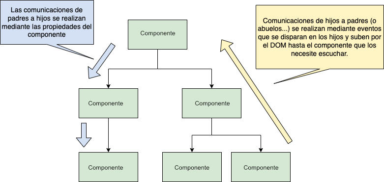
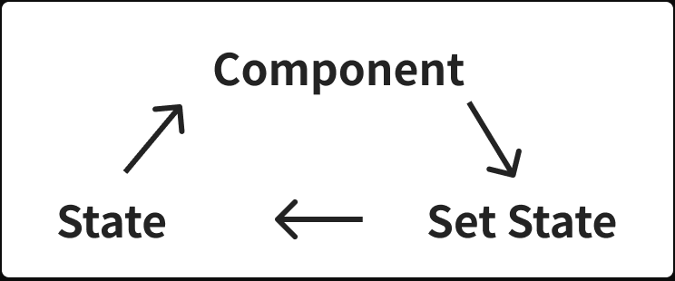

# Apunte 22

## Comunicación entre componentes padre e hijo

En React, los componentes se organizan en un árbol jerárquico, donde los componentes padres contienen uno o más componentes hijos. La comunicación entre componentes padre e hijo se utiliza para pasar información y datos entre ellos.



Existen dos maneras de pasar información de un componente padre a un componente hijo:

1.- Propiedades (**Props**): las propiedades son datos que se pasan de un componente padre a un componente hijo a través de los atributos del componente. Los datos se pueden pasar como cadenas, números, objetos, funciones, etc.

2.- Contexto (**Context**): el contexto es una forma de compartir datos entre componentes sin tener que pasar explícitamente las propiedades a través de cada nivel de la jerarquía de componentes. El contexto se define en el componente padre y se puede acceder en cualquier componente hijo.

Para pasar información de un componente hijo a un componente padre, se pueden utilizar funciones de devolución de llamada (callback functions). Las funciones de devolución de llamada son funciones que se pasan como propiedades a los componentes hijos y que se invocan en el componente hijo cuando se produce un evento o una acción.

### Comunicacion padre-hijo utilizando Props

Supongamos que queremos crear una lista de tareas. Primero, creamos un componente Padre llamado ListaTareas que contendrá todos los demás componentes:

```javascript
import React, { useState } from "react";
import Tarea from "./Tarea";

function ListaTareas() {
  const [tareas, setTareas] = useState([]);

  const agregarTarea = (nuevaTarea) => {
    setTareas([...tareas, nuevaTarea]);
  };

  const eliminarTarea = (indice) => {
    const nuevasTareas = [...tareas];
    nuevasTareas.splice(indice, 1);
    setTareas(nuevasTareas);
  };

  return (
    <div>
      <h1>Lista de Tareas</h1>
      <ul>
        {tareas.map((tarea, index) => (
          <Tarea
            key={index}
            tarea={tarea}
            indice={index}
            onDelete={eliminarTarea}
          />
        ))}
      </ul>
      <button onClick={() => agregarTarea("Nueva tarea")}>Agregar tarea</button>
    </div>
  );
}

export default ListaTareas;
```

En este componente, estamos utilizando el hook useState de React para mantener el estado de la lista de tareas (tareas). También estamos definiendo dos funciones, agregarTarea y eliminarTarea, que se utilizarán para agregar y eliminar tareas.

Luego, estamos utilizando el componente Hijo Tarea dentro del componente Padre ListaTareas para mostrar una lista de tareas. Estamos utilizando la función map() para crear una lista de elementos Tarea a partir del array de tareas (tareas). Cada tarea se pasa como prop al componente Tarea, junto con su índice y la función eliminarTarea como una función de devolución de llamada que se activa cuando se hace clic en el botón "Eliminar tarea".

También estamos agregando un botón "Agregar tarea" que utiliza la función agregarTarea para agregar una nueva tarea a la lista.

A continuación, creamos el componente Hijo llamado Tarea:

```javascript
import React from "react";

function Tarea(props) {
  return (
    <li>
      {props.tarea}
      <button onClick={() => props.onDelete(props.indice)}>Eliminar</button>
    </li>
  );
}

export default Tarea;
```

En este componente, estamos recibiendo una tarea como prop a través del argumento props. Estamos utilizando la propiedad props.tarea para mostrar el título de la tarea.

También estamos utilizando la prop props.onDelete como una función de devolución de llamada para manejar el evento de eliminación de la tarea. La función props.onDelete se activa cuando se hace clic en el botón "Eliminar", y se pasa el índice de la tarea como argumento.

Con estos dos componentes, podemos crear una lista de tareas dinámica que permite agregar y eliminar tareas a través de eventos. La comunicación entre componentes Padre e Hijo se realiza a través de las propiedades y funciones de devolución de llamada que se pasan de un componente a otro.

## Profundización en comunicación por Props y callbacks

Cuando se desea enviar información del hijo al padre, se recomienda resaltar que el padre define la función (callback) y se la pasa al hijo, quien la invoca. Este patrón puede visualizarse como:

```bash
Padre ──(props.función)──▶ Hijo ──(invoca)──▶ Padre
```

### 🧠 Consejo práctico

Nombrar las funciones como `onAlgo` en el padre y usarlas como `props.onAlgo` en el hijo mejora la legibilidad.

### ✅ Ejemplo adicional

**Componente padre (ListaMensajes):**  

```jsx
function ListaMensajes() {
  const [mensajes, setMensajes] = useState([]);

  const agregarMensaje = (texto) => {
    setMensajes([...mensajes, texto]);
  };

  return (
    <div>
      <NuevoMensaje onEnviar={agregarMensaje} />
      {mensajes.map((msg, i) => <p key={i}>{msg}</p>)}
    </div>
  );
}
```

**Componente hijo (NuevoMensaje):**  

```jsx
function NuevoMensaje({ onEnviar }) {
  const [texto, setTexto] = useState("");

  return (
    <div>
      <input value={texto} onChange={(e) => setTexto(e.target.value)} />
      <button onClick={() => onEnviar(texto)}>Enviar</button>
    </div>
  );
}
```

### Comunicacion padre-hijo utilizando el objeto Context

En React, el objeto Context permite compartir datos entre componentes sin tener que pasar explícitamente las props a través de cada nivel de la jerarquía de componentes. Esto puede ser especialmente útil en aplicaciones grandes donde hay muchos niveles de anidamiento de componentes y se necesita compartir datos comunes entre ellos.

Context se utiliza en React a través de dos componentes: Provider y el hook useContext. El componente Provider es responsable de proporcionar el valor del contexto a los componentes descendientes, mientras que el hook useContext se utiliza para acceder al valor del contexto .

Supongamos que queremos crear una lista de tareas y queremos que el tema de la aplicación se pueda cambiar desde cualquier componente de la lista de tareas. Para ello, podemos utilizar el objeto de contexto de React para compartir el tema entre los componentes.

Primero, creamos un objeto de contexto para el tema de la aplicación:

```javascript
import { createContext } from "react";

const ThemeContext = createContext("light");

export default ThemeContext;
```

En este objeto de contexto, estamos creando un contexto con un valor predeterminado de 'light'.

Luego, creamos un componente Padre llamado ListaTareas que proporciona el contexto a todos los componentes hijos:

```javascript
import React, { useState } from "react";
import ThemeContext from "./ThemeContext";
import Tarea from "./Tarea";

function ListaTareas() {
  const [tema, setTema] = useState("light");
  return (
    <ThemeContext.Provider value={tema}>
      <h1>Lista de Tareas</h1>
      <Tarea titulo="Tarea 1" />
      <Tarea titulo="Tarea 2" />
      <Tarea titulo="Tarea 3" />
      <label>
        <input
          type="checkbox"
          checked={tema === "dark"}
          onChange={(e) => {
            setTema(e.target.checked ? "dark" : "light");
          }}
        />
        Usar modo oscuro
      </label>
    </ThemeContext.Provider>
  );
}

export default ListaTareas;
```

En este componente, estamos utilizando el componente ThemeContext.Provider para proporcionar el valor inicial 'light' del contexto a todos los componentes hijos (Tarea). También estamos creando tres componentes Tarea y pasando el título de cada tarea como prop.

Luego, creamos un componente Hijo llamado Tarea que utiliza el contexto para mostrar el tema actual:

```javascript
import React from "react";
import ThemeContext from "./ThemeContext";
import "./Tarea.css";

function Tarea(props) {
  const tema = React.useContext(ThemeContext);
  return (
    <div className={tema}>
      <span>{props.titulo}</span>
    </div>
  );
}

export default Tarea;
```

En este componente, estamos utilizando el hook useContext para acceder al valor del contexto (tema). Luego, utilizamos el valor del contexto para establecer la clase CSS de la tarea y mostrar el título de la tarea (&lt;span&gt;{props.titulo}&lt;/span&gt;).

Con estos tres componentes, podemos crear una lista de tareas dinámica que permite cambiar el tema de la aplicación desde cualquier componente de la lista de tareas utilizando el objeto de contexto de React. La comunicación entre componentes Padre e Hijo se realiza a través del objeto de contexto que se proporciona al componente Padre y se utiliza en los componentes hijos.

y el css para la tarea sería:

```css
.dark {
  background-color: #222;
  color: #fff;
  border-color: #444;
}

.light {
  background-color: #f5f4f4;
  color: #0e0e0e;
  border-color: #444;
}
```

### Hook useContext

En componentes funcionales de React, se puede utilizar el hook useContext para acceder al valor del contexto.

El hook useContext es una forma más sencilla y concisa de acceder al valor del contexto en los componentes funcionales de React.

Para utilizar useContext, primero se debe crear el objeto de contexto de la misma manera que se hace para el componente Provider. Luego, se puede utilizar useContext para acceder al valor del contexto en cualquier componente descendiente:

1.- Crear el objeto de contexto:

```javascript
import React from "react";

const MiContexto = React.createContext();
```

2.- Proporcionar el valor del contexto en el componente Padre utilizando el componente Provider

```javascript
import React from "react";
import MiContexto from "./MiContexto";
import ComponenteHijo from "./ComponenteHijo";

function ComponentePadre() {
  return (
    <MiContexto.Provider value={{ nombre: "Juan", edad: 30 }}>
      <ComponenteHijo />
    </MiContexto.Provider>
  );
}

export default ComponentePadre;
```

3.- Acceder al valor del contexto utilizando el hook useContext en el componente Hijo:

```javascript
import React, { useContext } from "react";
import MiContexto from "./MiContexto";

function ComponenteHijo() {
  const valorContexto = useContext(MiContexto);

  return (
    <div>
      <p>Nombre: {valorContexto.nombre}</p>
      <p>Edad: {valorContexto.edad}</p>
    </div>
  );
}

export default ComponenteHijo;
```

En este ejemplo, se utiliza el hook useContext para acceder al valor del contexto (valorContexto) en el componente Hijo y mostrar las propiedades nombre y edad.

Con esto, hemos creado una comunicación entre componentes Padre e Hijo utilizando el objeto Context de React en componentes funcionales y el hook useContext.

## Profundización en Context API y `useContext`

Es útil mencionar que el Context está pensado para **datos compartidos globalmente**: usuario actual, tema, idioma, etc. No reemplaza Redux pero puede evitar su uso en apps medianas.

### 🔄 Flujo típico

```bash
<App>
 └── <Provider value={...}>
       ├── <HijoA />
       └── <HijoB /> usa useContext()
```

### ✅ Ejemplo adicional con login

```jsx
const UsuarioContext = createContext();

function App() {
  const [usuario, setUsuario] = useState(null);

  return (
    <UsuarioContext.Provider value={{ usuario, setUsuario }}>
      <Header />
      <Contenido />
    </UsuarioContext.Provider>
  );
}

function Header() {
  const { usuario } = useContext(UsuarioContext);
  return <div>Bienvenido: {usuario?.nombre || "Invitado"}</div>;
}
```

Este patrón es base para manejar sesiones sin pasar props por todos lados.

# Formularios en React

Los formularios son una parte fundamental de las aplicaciones web, los mismos permiten crear aplicaciones interactivas ya que con ellos podemos validar y enviar información a nuestros servidores. La verdad es que trabajar con formularios puede ser más desafiante de lo que pudiéramos creer.

Para crear un buen formulario, debemos tener en cuenta los siguientes aspectos:

- Accesibilidad: Millones de usuarios en el mundo sufren algún tipo de discapacidad y navegan los sitios web a través de herramientas diferentes al mouse y el teclado, por lo tanto, debemos tener en cuenta la semántica de los elementos HTML que usemos para crear el formulario, además no será suficiente usar las estrategias de validación convencionales propuestas por los navegadores.
- Validación: Cada campo que existe en el formulario puede tener unas reglas particulares. Unos campos pueden ser opcionales, otros obligatorios, también permiten ingresar correos electrónicos, pueden requieren valores mínimos o máximos, entre otros. Comunicar a todos los usuarios acerca de los valores permitidos en un campo específico es una función fundamental de las validaciones de campos.
- Serialización: Cuando un usuario ha terminado de diligenciar el formulario, su información se encuentra en algún espacio de memoria en el que usa la aplicación. Obtener esa información, manipularla y enviarla adecuadamente puede ser un reto en algunas ocasiones.

# Patrones de React para crear formularios

## Componentes Controlados

Un componente controlado es aquel que usa los cambios de estado o cambios de props como fuente de verdad para representarse en el DOM.
De manera más concreta, es un componente que mantiene una sincronización entre el estado de React y el valor del campo, si el estado cambia, el valor cambia.
Puedes pensar en el cómo un proceso cíclico:
Relación entre un componente, su cambio de estado y el estado en sí mismo



Un componente controlado en React es un componente que mantiene su estado interno como fuente única de verdad para todos sus datos, lo que significa que los datos son controlados por el componente y no por el DOM. En el contexto de los formularios en React, esto significa que el valor del formulario es controlado por el estado del componente.

Un componente controlado es un componente que tiene una propiedad value vinculada a su estado interno, lo que permite que el estado del componente sea la fuente única de verdad para el valor del formulario. Cuando el usuario interactúa con el formulario, React actualiza el estado interno del componente y el valor del formulario se actualiza automáticamente para reflejar el nuevo estado.

Por ejemplo, un componente de formulario controlado podría ser así:

```javascript
import React, { useState } from "react";

function FormularioControlado() {
  const [nombre, setNombre] = useState("");

  function handleChange(event) {
    setNombre(event.target.value);
  }

  function handleSubmit(event) {
    event.preventDefault();
    alert(`El nombre ingresado es: ${nombre}`);
  }

  return (
    <form onSubmit={handleSubmit}>
      <label>
        Nombre:
        <input type="text" value={nombre} onChange={handleChange} />
      </label>
      <button type="submit">Enviar</button>
    </form>
  );
}
```

En este ejemplo, estamos utilizando un componente controlado para manejar un formulario de entrada de nombre. El estado interno del componente nombre está vinculado a la propiedad value del input del formulario, lo que significa que el valor del input siempre reflejará el estado actual del componente.

Cuando el usuario interactúa con el formulario, el evento onChange se activa y llama a la función handleChange, que actualiza el estado interno del componente con el valor actual del input. Luego, cuando se envía el formulario, la función handleSubmit muestra una alerta con el valor ingresado en el formulario.

En resumen, un componente controlado es un componente que mantiene su estado interno como la fuente única de verdad para los datos del formulario, y se utiliza para manejar los datos del formulario de manera eficiente y predecible en React.

## Componentes No Controlados

Un componente no controlado en React es un componente que no mantiene su estado interno como fuente única de verdad para los datos del formulario, lo que significa que los datos del formulario no son controlados por el componente. En lugar de eso, los datos del formulario son manejados por el DOM directamente.

En un componente no controlado, el valor del formulario es manejado por el DOM en lugar del componente de React. En lugar de utilizar el estado interno del componente para controlar el valor del formulario, el valor del formulario se maneja directamente a través del DOM utilizando una referencia a un elemento HTML.

Por ejemplo, un componente de formulario no controlado podría ser así:

```javascript
import React, { useRef } from "react";

function FormularioNoControlado() {
  const inputRef = useRef(null);

  function handleSubmit(event) {
    event.preventDefault();
    alert(`El nombre ingresado es: ${inputRef.current.value}`);
  }

  return (
    <form onSubmit={handleSubmit}>
      <label>
        Nombre:
        <input type="text" ref={inputRef} />
      </label>
      <button type="submit">Enviar</button>
    </form>
  );
}
```

En este ejemplo, estamos utilizando un componente no controlado para manejar un formulario de entrada de nombre. En lugar de mantener el valor del input en el estado interno del componente, estamos utilizando una referencia a un elemento HTML (inputRef) para acceder al valor del input.

La propiedad ref del input es una forma de acceder al nodo del DOM generado por un componente de React. Es útil para interactuar directamente con los elementos del DOM, como cuando se necesita acceder al valor de un input o para enfocar un input.

Cuando se utiliza ref en un input, se puede acceder al elemento HTML generado por el input mediante una referencia. La referencia se define como una variable de JavaScript en el componente y se pasa a la propiedad ref del input.

Cuando el usuario interactúa con el formulario, el evento onSubmit se activa y llama a la función handleSubmit, que accede al valor del input a través de la referencia inputRef y muestra una alerta con el valor ingresado en el formulario.

En resumen, un componente no controlado es un componente que no mantiene su estado interno como fuente única de verdad para los datos del formulario, y se utiliza para manejar los datos del formulario de manera más sencilla y flexible en React, aunque puede ser menos predecible y menos eficiente que los componentes controlados.

### Componentes Controlados vs Componentes no controlados

React recomienda trabajar con componentes controlados siempre que sea posible. Esto se debe a que los componentes controlados ofrecen varios beneficios:

1. El estado interno del componente es la fuente única de verdad para los datos del formulario, lo que significa que es más fácil de mantener y predecible.

2. El valor del formulario se actualiza automáticamente cuando se actualiza el estado interno del componente, lo que elimina la necesidad de actualizar el DOM manualmente.

3. Los componentes controlados son más seguros y resistentes a errores, ya que el valor del formulario siempre es controlado por el componente y no por el usuario o el DOM.

En algunos casos, puede ser necesario utilizar componentes no controlados, especialmente cuando se trabaja con formularios complejos o con bibliotecas de terceros que no soportan componentes controlados. Sin embargo, se recomienda utilizar componentes controlados siempre que sea posible.

En resumen, React recomienda trabajar con componentes controlados siempre que sea posible debido a los beneficios que ofrecen en términos de previsibilidad, seguridad y mantenibilidad.

## Eventos onClick y onChange

En React, los eventos onClick y onChange son dos de los eventos más comunes que se utilizan para manejar la interacción del usuario con la interfaz de usuario. Ambos eventos se utilizan en conjunto con los elementos del DOM para manejar las acciones del usuario, como hacer clic en un botón o escribir en un input.

El evento onClick se activa cuando el usuario hace clic en un elemento del DOM, como un botón, un enlace o una imagen. Cuando se activa este evento, se ejecuta una función que puede realizar una acción en respuesta al clic del usuario. Por ejemplo, se puede usar un onClick para mostrar o ocultar un elemento en la página, para redirigir a otra página, o para hacer una solicitud a una API.

El evento onChange se activa cuando el usuario cambia el valor de un elemento de entrada, como un input o un select. Cuando se activa este evento, se ejecuta una función que actualiza el estado del componente con el nuevo valor del elemento. Por ejemplo, se puede usar un onChange para actualizar el valor de un input controlado o para cambiar el contenido de una lista de opciones.

Un ejemplo de cómo usar onChange podría ser el siguiente:

```javascript
import React, { useState } from "react";

function Formulario() {
  const [nombre, setNombre] = useState("");

  function handleChange(event) {
    setNombre(event.target.value);
  }

  return (
    <form>
      <label>
        Nombre:
        <input type="text" value={nombre} onChange={handleChange} />
      </label>
    </form>
  );
}
```

En este ejemplo, estamos utilizando onChange para actualizar el estado interno del componente con el valor actual del input. Cada vez que el usuario escribe algo en el input, se activa el evento onChange y llama a la función handleChange, que actualiza el estado interno del componente con el valor actual del input.

En resumen, los eventos onClick y onChange son dos eventos comunes en React que se utilizan para manejar la interacción del usuario con la interfaz de usuario. onClick se activa cuando el usuario hace clic en un elemento del DOM, mientras que onChange se activa cuando el usuario cambia el valor de un elemento de entrada. Ambos eventos son fundamentales para la interacción del usuario en una aplicación de React.

## Componentes Controlados vs No Controlados

Se puede reforzar con esta analogía:

- **Controlado**: React es el "dueño" del input. Cada cambio va al estado.
- **No controlado**: el DOM tiene el valor, y React lo "lee" si lo necesita.

### 📌 Comparativa directa

| Aspecto        | Controlado                | No Controlado           |
|----------------|---------------------------|-------------------------|
| Fuente de verdad | Estado de React          | Valor en el DOM         |
| Acceso         | `value` y `onChange`      | `ref.current.value`     |
| Validación     | Más sencilla y flexible   | Manual                  |
| Sincronización | Siempre con el estado     | Parcial / reactiva      |

### ⚠️ Recomendación

Usar **controlados por defecto**. Los no controlados solo cuando hay necesidad puntual (ej. formularios de terceros, alto rendimiento).

---

## Eventos `onClick` y `onChange` en contexto

Es útil mostrar cómo estos eventos alimentan el estado, especialmente cuando se usan múltiples campos.

### ✅ Ejemplo extendido

```jsx
function FormularioUsuario() {
  const [form, setForm] = useState({ nombre: "", email: "" });

  const handleChange = (e) => {
    setForm({ ...form, [e.target.name]: e.target.value });
  };

  return (
    <form>
      <input name="nombre" value={form.nombre} onChange={handleChange} />
      <input name="email" value={form.email} onChange={handleChange} />
      <button onClick={() => alert(JSON.stringify(form))}>Enviar</button>
    </form>
  );
}
```

Este patrón permite formularios escalables sin necesidad de múltiples estados.

---

## Ejemplo integrador final: Formulario con estado global

Combina `useContext` + formulario controlado + eventos:

```jsx
const DatosContext = createContext();

function App() {
  const [datos, setDatos] = useState({});

  return (
    <DatosContext.Provider value={{ datos, setDatos }}>
      <Formulario />
      <Resumen />
    </DatosContext.Provider>
  );
}

function Formulario() {
  const { setDatos } = useContext(DatosContext);
  const [nombre, setNombre] = useState("");

  return (
    <form onSubmit={(e) => {
      e.preventDefault();
      setDatos({ nombre });
    }}>
      <input value={nombre} onChange={(e) => setNombre(e.target.value)} />
      <button type="submit">Guardar</button>
    </form>
  );
}

function Resumen() {
  const { datos } = useContext(DatosContext);
  return <p>Nombre guardado: {datos.nombre}</p>;
}
```

Este tipo de estructura es excelente para simular un wizard de pasos o formularios conectados.

## 📚 Recursos complementarios

- [Documentación oficial sobre Context – React.dev](https://react.dev/learn/passing-data-deeply-with-context)
- [Componentes controlados vs no controlados – React Docs](https://reactjs.org/docs/forms.html)
- [Refs y componentes no controlados](https://reactjs.org/docs/uncontrolled-components.html)
- [Hook useContext – API Reference](https://react.dev/reference/react/useContext)
